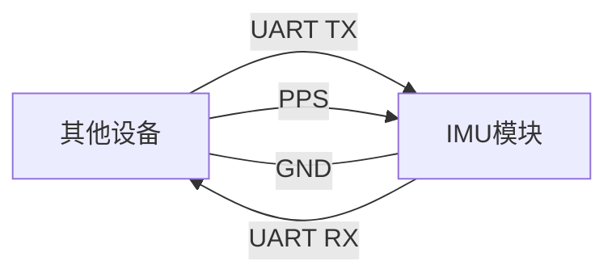

# 志翔`IMU`通讯协议&指令说明文档

[TOC]


------

# 1 文档概述

​	本文档主要是描述志翔私有协议，用于集成和配置志翔产品的重要资源。

​	志翔私有协议规范描述了志翔`IMU`产品使用的通信数据格式，包括两部分输出数据帧和输入（配置）数据帧。该文档所有的协议在我司的**上位机软件**中可以进行解析，并提供对应的解析方法。


# 2 AT指令

​	志翔`IMU`支持的AT集如下：

| 指令                             | 功能                 | 应答                                                         | 描述                                                         |
| -------------------------------- | -------------------- | ------------------------------------------------------------ | ------------------------------------------------------------ |
| `AT+VERSION?\r\n`                | 版本查询             | `AppVersion:3.0.0.4`<br/>`HardwareVersion:1.0.0.0`<br/>`OK`  | 示例指令：版本查询<br />`AppVersion:V3.0.0.4`<br />`HardwareVersion:V1.0.0.0` |
| `AT+BAUD?\r\n`                   | 波特率查询           | `UARTBaudRate:921600`<br/> `OK`                              | 示例指令：波特率查询                                         |
| `AT+BAUD=921600\r\n`             | 波特率设置           | `OK`                                                         | 示例指令：设置波特率为921600<br />指令配置后**重启生效**     |
| `AT+SET=ON\r\n`                  | 当前数据流输出控制   | `OK`                                                         | 示例指令：开启当前数据流输出<br />ON：开启当前数据流<br />OFF：关闭当前数据流 |
| `AT+SET?\r\n`                    | 查询当前数据流状态   | `OFF`<br />`OK`                                              | 示例指令：查询当前数据流状态<br />ON:：开启当前数据流<br />OFF：关闭当前数据流 |
| `AT+CONFIG\r\n`                  | 查询用户参数         | `UARTBaudRate:921600`<br/>`CoordinateSystem:100`<br/>`DataPushFre:50Hz`<br /> `OK` | 示例指令：用户当前配置的参数查询<br />串口波特率：921600<br />坐标系：100<br />推送频率：`50HZ` |
| `AT+COORDINATE?\r\n`             | `IMU`坐标系查询      | `CoordinateSystem:200`<br/> `OK`                             | 示例指令：`IMU`当前坐标系查询<br />坐标系：200               |
| `AT+COORDINATE=200\r\n`          | `IMU`坐标系设置      | `OK`                                                         | 示例指令：设置`IMU`坐标系为200<br />支持的坐标系如下：<br />100/110/120/130<br />200/210/220/230<br />300/310/320/330<br />400/410/420/430<br />500/510/520/530<br />600/610/620/630 |
| `AT+PPS=ON\r\n`                  | PPS开关状态控制      | `OK`                                                         | 示例指令：开启PPS功能<br />ON：开启<br />OFF：关闭           |
| `AT+PPS?\r\n`                    | PPS开关状态查询      | `PPSStatus:OFF`<br/> `OK`                                    | 示例指令：PPS开关状态查询，PPS关闭<br />ON：开启<br />OFF：关闭 |
| `AT+PPSMODE=1\r\n`               | PPS模式配置          | `0K`                                                         | 示例指令：配置PPS模式为1<br />1：`PPS`校准内部时间戳<br />2：`PPS`外部触发`IMU`数据输出 |
| `AT+PPSMODE?\r\n`                | PPS模式查询          | `PPSMode:2`<br/>`OK`                                         | 示例指令：PPS模式查询,当前PPS模式为2                         |
| `AT+RST\r\n`                     | 复位重启             | `OK`                                                         | 示例指令：复位重启                                           |
| `AT+MSGID=13,0\r\n`              | 推送报文控制         | `OK`                                                         | 示例指令：13号报文推送关闭<br />`AT+MSGID=<MsgID>,<status>\r\n`<br />`MsgID:`1,2,10,13<br />`1：0x0001`报文<br />`2：0x0002`报文<br />`10：0x0010报文`<br />`13：0x0013报文`<br />`Status:`0,1<br />0：关闭<br />1：开启 |
| `AT+PUSHFRQ?\r\n`                | 推送数据频率查询     | `DataPushFre:1Hz`<br/> `OK`                                  | 示例指令：用户推送数据频率查询                               |
| `AT+PUSHFRQ=1000\r\n`            | 推送频率设置         | `OK`                                                         | 示例指令：设置用户数据推送频率为`1Hz`<br />`1000：1Hz`<br />`200:5Hz`<br />`100：10Hz`<br />`50：20Hz`<br />`20：50Hz`<br />`10:100Hz`<br />`5:200Hz`<br />`2:500Hz`<br />`1:1000Hz` |
| `AT+CANBAUD?\r\n`                | CAN波特率查询        | `CANBaudRate:1000`<br/> `OK`                                 | 示例指令：查询CAN的波特率为`1000Kbps`<br />`250：250kbps`<br />`500：500kbps`<br />`1000：1000Kbps` |
| `AT+CANBAUD=500\r\n`             | 设置CAN波特率        | `OK`                                                         | 示例指令：设置CAN的波特率为`500kbps`<br />`250：250kbps`<br />`500：500kbps`<br />`1000：1000kbps`<br />**重启后生效** |
| `AT+SN?\r\n`                     | `SN`号查询           | `SN:Z351ZZ0123456789`<br/> `OK`                              | 示例指令：SN号查询                                           |
| `AT+ZEROBIASCAL=ON\r\n`          | 零偏校准             | `OK`                                                         | 示例指令：开启零偏校准<br />ON：开启<br />OFF：关闭<br />**注意事项：**零偏校准过程中不能移动`IMU` |
| `AT+DATATIME?`                   | 查询系统时间         | `DataTime:2026-7-23 15:36:10`<br/>`OK`                       | 示例指令：查询到的系统时间为2026年7月23日 `15:36:10`         |
| `AT+DATATIME=2026 7 23-15:30:00` | 设置系统时间         | `OK`                                                         | 示例指令：设置系统时间为2026年7月23日 `15:30:00`<br />**备注：**该指令掉电不保存 |
| `AT+DATALINK?\r\n`               | 数据链路状态查询     | `DATALINK CAN: OFF`<br/>`DATALINK UART: OFF`<br/>`DATALINK AT: OFF`<br/>`OK` | 示例指令：数据链路推送状态查询(UART/AT/CAN均关闭推送)        |
| `AT+DATALINK=UART,0\r\n`         | 用户串口数据推送关闭 | `OK`                                                         | 示例指令：用户UART推送数据关闭<br />`AT+DATALINK=<CAN|UART|AT>,<0|1>`<br />用户串口：`UART`<br />用户AT：`AT`<br />用户CAN：`CAN`<br />关闭：0<br />打开：1 |
| `AT+YAWRESET`                    | `YAW`角归零重置      | `OK`                                                         | 示例指令：`YAW`角归零重置                                    |

> [!IMPORTANT]
>
> 1. AT指令必须是**大写**，且须以回车换行符结尾(`CRLF`)。
> 2. 串口默认波特率为 921600，8 bit 数据位，1 位停止位，无校验。
> 3. 任何指令中参数不能包含空格、制表符等不可见字符。
> 4. 设置参数时不能超出参数的取值范围。
> 5. 所有的AT指令均有应答`OK`回复。
> 6. 所有的AT设置指令均为掉电保存。


# 3 协议介绍

​	志翔私有协议用于主控和模块之间进行通信，该协议具备一下特性：

1. 紧凑：使用`8bit`二进制数据；

2. 数据校验：使用低开销的校验算法；

3. 统一：所有多字节数据都是**小端模式**,包括数据部分；

4. 命令`CMD`说明：`CMD`为`0x01`的为定制报文数据，`CMD`为`0x00`的为通用报文数据；

5. 报文`ID`说明：报文ID由命令`CMD`+`ID`组成；

   

## 3.1 串口输出协议

### 3.1.1 协议帧格式

​	志翔私有协议输出协议采用固定的格式，帧结构包含五部分：帧头、`CMD`、ID、报文长度、数据域、校验码，如下表所示：

| 帧头        | `CMD` | ID    | 报文长度     | 数据域                     | 校验码1 | 校验码2 |
| ----------- | ----- | ----- | ------------ | -------------------------- | ------- | ------- |
| `0xAA 0x55` | 0~255 | 0~255 | 最大值 65535 | 数据包头到最后一个字节数据 | 校验码  | 校验码  |
| 2字节       | 1字节 | 1字节 | 2字节        | 0~255 字节                 | 1字节   | 1字节   |

​	串口输出协议帧结构体定义如下：

```c
/* 串口输出协议帧报文头 */
typedef __packed struct
{
    unsigned char Head1; /* 帧头 0xAA */
    unsigned char Head2; /* 帧头 0x55 */
    unsigned char CMD;   /* CMD */
    unsigned char ID;    /* ID */
    unsigned short Len;  /* 报文长度 */
} SerialOutFrameHead_S, *pSerialOutFrameHead_S;

/* 串口输出数据包结构 */
typedef __packed struct
{
    SerialOutFrameHead_S SerialOutFrameHead;
    DATA, /* 输出的数据结构体，详情参考2.1.2有效数据定义规则章节内容 */
    unsigned short CRC16;
}SerialOutData_S,*pSerialOutData_S
```


### 3.1.2 有效数据定义规则

​	有效输出报文`ID`如下：

|   报文ID    | 报文类型                     |
| :---------: | :--------------------------- |
| `0x00 0x01` | 传感器推送数据1              |
| `0x00 0x02` | 设备状态推送数据             |
| `0x00 0x09` | 磁力计校准推送数据           |
| `0x00 0x10` | 传感器推送数据2              |
| `0x00 0x13` | 传感器推送数据3              |
| `0x01 0x02` | 设备状态数据与传感器推送数据 |
|             |                              |


### 3.1.3  通用输出数据

#### 3.1.3.1 传感器推送数据1(`0x00 0x01`)

​	具体的数据格式如下：

| 字段                       | 偏移(字节) | 长度(字节) |        类型        | 单位 | 描述 |
| -------------------------- | :--------: | :--------: | :----------------: | :--: | ---- |
| 报文头(Header)             |     0      |     6      |                    |      |      |
| 推送频率                   |     6      |     4      |    unsigned int    |  Hz  |      |
| 年                         |     10     |     2      | unsigned short int |      |      |
| 月                         |     12     |     1      |   unsigned char    |      |      |
| 日                         |     13     |     1      |   unsigned char    |      |      |
| 时                         |     14     |     1      |   unsigned char    |      |      |
| 分                         |     15     |     1      |   unsigned char    |      |      |
| 秒                         |     16     |     1      |   unsigned char    |      |      |
| 加速度(X/Y/Z/\|A\|模长)    |     17     |     16     |      float[4]      | m/s² |      |
| 角速度(X/Y/Z/\|W\|模长)    |     33     |     16     |      float[4]      | °/s  |      |
| `IMU`温度                  |     49     |     4      |       float        |  ℃   |      |
| 三轴姿态(`Roll/Pitch/Yaw`) |     53     |     12     |      float[3]      |  °   |      |
| 四元数(`q1/q2/q3/q4`)      |     65     |     16     |      float[4]      |      |      |
| 磁场                       |     81     |     12     |      float[3]      |      |      |
| `CRC16`                    |     93     |     2      | unsigned short int |      |      |
|                            |            |            |                    |      |      |


#### 3.1.3.2 设备状态数据推送(`0x00 0x02`)

| 字段           | 偏移(字节) | 长度(字节) |      类型      | 单位 | 描述 |
| -------------- | :--------: | :--------: | :------------: | :--: | ---- |
| 报文头(Header) |     0      |     6      |                |      |      |
| 用户A值        |     6      |     1      | unsigned char  |      |      |
| 电池电量       |     7      |     1      | unsigned char  |      |      |
| `CRC16`        |     8      |     2      | unsigned short |      |      |


#### 3.1.3.3 磁力计校准推送数据(`0x00 0x09`)

| 字段           | 偏移(字节) | 长度(字节) |      类型      | 单位 | 描述                     |
| -------------- | :--------: | :--------: | :------------: | :--: | ------------------------ |
| 报文头(Header) |     0      |     6      |                |      |                          |
| 校准进度       |     6      |     4      |     float      |      | 校准进度到100%即校准成功 |
| `CRC16`        |     10     |     2      | unsigned short |      |                          |


#### 3.1.3.4 传感器推送数据2(`0x00 0x10`)

​	推送数据格式内容如下：

| 字段                       | 偏移(字节) | 长度(字节) |        类型        | 单位 | 描述 |
| -------------------------- | :--------: | :--------: | :----------------: | :--: | ---- |
| 报文头(Header)             |     0      |     6      |                    |      |      |
| 时间戳                     |     6      |     8      | unsigned long long |  us  |      |
| 加速度(X/Y/Z)              |     14     |     12     |      float[3]      | m/s² |      |
| 角速度(X/Y/Z)              |     26     |     12     |      float[3]      | °/s  |      |
| 三轴姿态(`Roll/Pitch/Yaw`) |     38     |     12     |      float[3]      |  °   |      |
| `CRC16`                    |     50     |     2      | unsigned short int |      |      |
|                            |            |            |                    |      |      |


#### 3.1.3.5 传感器推送数据3(`0x00 0x13`)

​	推送数据格式内容如下：

| 字段                       | 偏移(字节) | 长度(字节) |        类型        | 单位 | 描述                                                         |
| -------------------------- | :--------: | :--------: | :----------------: | :--: | ------------------------------------------------------------ |
| 报文头(Header)             |     0      |     6      |                    |      |                                                              |
| 推送频率                   |     6      |     4      |    unsigned int    |  Hz  |                                                              |
| 年                         |     10     |     2      | unsigned short int |      |                                                              |
| 月                         |     12     |     1      |   unsigned char    |      |                                                              |
| 日                         |     13     |     1      |   unsigned char    |      |                                                              |
| 时                         |     14     |     1      |   unsigned char    |      |                                                              |
| 分                         |     15     |     1      |   unsigned char    |      |                                                              |
| 秒                         |     16     |     1      |   unsigned char    |      |                                                              |
| 时间戳                     |     17     |     8      | unsigned long long |  us  |                                                              |
| PPS锁定状态                |     25     |     1      |   unsigned char    |      | 0：失锁<br />1：锁定                                         |
| PPS模式                    |     26     |     1      |   unsigned char    |      | 1：`PPS`模式1<br />2：`PPS`模式2<br />3：`PPS`模式3<br />4：`PPS`模式4 |
| 加速度(X/Y/Z/\|A\|模长)    |     27     |     16     |      float[4]      | m/s² |                                                              |
| 角速度(X/Y/Z/\|W\|模长)    |     43     |     16     |      float[4]      | °/s  |                                                              |
| `IMU`温度                  |     59     |     4      |       float        |  ℃   |                                                              |
| 三轴姿态(`Roll/Pitch/Yaw`) |     63     |     12     |      float[3]      |  °   |                                                              |
| 四元数(`q1/q2/q3/q4`)      |     75     |     16     |      float[4]      |      |                                                              |
| 磁场                       |     91     |     12     |      float[3]      |      |                                                              |
| 预留                       |    103     |     8      |   unsigned char    |      |                                                              |
| `CRC16`                    |    111     |     2      | unsigned short int |      |                                                              |
|                            |            |            |                    |      |                                                              |


### 3.1.4 定制推送数据

#### 3.1.4.1 设备状态与传感器数据推送(`0x01 0x02`)

| 字段                       | 偏移(字节) | 长度(字节) |        类型        | 单位 | 描述 |
| -------------------------- | :--------: | :--------: | :----------------: | :--: | ---- |
| 报文头(Header)             |     0      |     6      |                    |      |      |
| 推送频率                   |     6      |     4      |    unsigned int    |  Hz  |      |
| 加速度(X/Y/Z/\|A\|模长)    |     10     |     16     |      float[4]      | m/s² |      |
| 角速度(X/Y/Z/\|W\|模长)    |     26     |     16     |      float[4]      | °/s  |      |
| `IMU`温度                  |     42     |     4      |       float        |  ℃   |      |
| 三轴姿态(`Roll/Pitch/Yaw`) |     46     |     12     |      float[3]      |  °   |      |
| 四元数(`q1/q2/q3/q4`)      |     58     |     16     |      float[4]      |      |      |
| 磁场                       |     74     |     12     |      float[3]      |      |      |
| 电池电量                   |     86     |     1      |   unsigned char    |      |      |
| A值                        |     87     |     1      |   unsigned char    |      |      |
| `CRC16`                    |     88     |     2      | unsigned short int |      |      |
|                            |            |            |                    |      |      |


## 3.2 串口交互协议帧格式

### 3.2.1 输入协议帧格式

​	志翔串口交互指令协议格式与默认报文输出格式不同，帧结构包括：帧头、命令`CMD`、ID、操作符、数据长度、数据域、校验码。如下表所示：

| 帧头        | 命令`CMD` | ID    | 操作符 | 报文长度     | 数据域                     | 校验码1 | 校验码2 |
| ----------- | --------- | ----- | ------ | ------------ | -------------------------- | ------- | ------- |
| `0xAA 0x55` | 0~255     | 0~255 | 0~255  | 最大值 65535 | 数据包头到最后一个字节数据 | 校验码  | 校验码  |
| 2字节       | 1字节     | 1字节 | 1字节  | 2字节        | 0~255 字节                 | 1字节   | 1字节   |

​	交互协议帧头结构体定义如下：

```c
/* 串口交互协议帧格式头 */
typedef __packed struct
{
    unsigned char Head1; /* 帧头 0xAA */
    unsigned char Head2; /* 帧头 0x55 */
    unsigned char CMD;   /* CMD */
    unsigned char ID;    /* ID */
    unsigned char Op;    /* 操作符，查询或写入 0x00:查询 0x01:写入RAM掉电不保存 0x02:写入FLASH掉电保存 */
    unsigned short Len;  /* 报文长度 */
} HexFrameHead_S, *pHexFrameHead_S;

/* 串口教书数据包结构 */
typedef __packed struct
{
    HexFrameHead_S HexFrameHead;
    DATA, /* 输出的数据结构体，详情参考2.2.2有效数据定义规则章节内容 */
    unsigned short CRC16;
}SerialInteractiveData_S,*pSerialInteractiveData_S
```


### 3.2.2 输入有效数据定义规则

​	报文数据ID定义如下：

|   报文ID    | 报文类型                     |
| :---------: | ---------------------------- |
| `0x00 0x03` | 版本查询                     |
| `0x00 0x04` | 传感器数据推送频率设置与查询 |
| `0x00 0x05` | 修改蓝牙名称                 |
| `0x00 0x06` | 算法模式查询与设置           |
| `0x00 0x07` | 当前数据推送状态配置/查询    |
| `0x00 0x08` | 磁力计校准                   |
| `0x00 0x11` | 推送报文ID控制               |
| `0x00 0x12` | PPS开关控制                  |
| `0x00 0x14` | 复位重启                     |
| `0x00 0x15` | `IMU`坐标系设置              |
| `0x00 0x16` | 串口波特率设置与查询         |
| `0x00 0x17` | CAN波特率设置                |
| `0x00 0x18` | SN号查询                     |
| `0x00 0x19` | 时间设置                     |
| `0x01 0x01` | A值查询与设置                |
| `0x01 0x03` | 电池电量查询                 |
|             |                              |
|             |                              |
|             |                              |
|             |                              |

​	协议仅支持表格中罗列的从操作符，如发送数据中操作符不在定义范围内的均为无效操作符，志翔`IMU`支持的操作符定义如下：

| 操作符 | 说明                     |
| :----: | ------------------------ |
| `0x00` | 查询功能                 |
| `0x01` | 配置到 RAM，即掉电不保存 |
| `0x02` | 配置到 Flash，即掉电保存 |

### 3.2.3 通用配置指令

#### 3.2.3.1 版本查询(`0x00 0x03`)

- **指令支持如下：**
- [x] 支持查询
  
- [ ] 支持配置到RAM，掉电不保存
  
- [ ] 支持配置到FLASH，掉电保存

**查询发送：**

| 字段           | 偏移(字节) | 长度(字节) |      类型      | 说明 |
| -------------- | :--------: | :--------: | :------------: | :--- |
| 报文头(Header) |     0      |     7      |                |      |
| `CRC16`        |     7      |     2      | unsigned short |      |

**回复：**

| 字段           | 偏移(字节) | 长度(字节) |      类型      | 说明 |
| -------------- | :--------: | :--------: | :------------: | :--- |
| 报文头(Header) |     0      |     6      |                |      |
| `APP`版本      |     6      |     4      |  unsigned int  |      |
| 硬件版本       |     10     |     4      |  unsigned int  |      |
| `CRC16`        |     14     |     2      | unsigned short |      |


#### 3.2.3.2 传感器数据推送频率设置与查询(`0x00 0x04`)

- **指令支持如下：**
  - [x] 支持查询
  - [x] 支持配置到RAM，掉电不保存
  - [x] 支持配置到FLASH，掉电保存

- **支持的频率如下：**
- `0x01`：数据按照`1Hz`频率推送
  
- `0x02`：数据按照`5Hz`频率推送
  
- `0x03`：数据按照`10Hz`频率推送
  
- `0x04`：数据按照`20Hz`频率推送
  
- `0x05`：数据按照`50Hz`频率推送
  
- `0x06`：数据按照`100Hz`频率推送
  
- `0x07`：数据按照`200Hz`频率推送
  
- `0x08`：数据按照`500Hz`频率推送
  
- `0x09`：数据按照`1000Hz`频率推送	


**查询/设置发送：**

| 字段           | 偏移(字节) | 长度(字节) |      类型      | 说明                                |
| -------------- | :--------: | :--------: | :------------: | :---------------------------------- |
| 报文头(Header) |     0      |     7      |                |                                     |
| `DATA`         |     7      |     1      | unsigned char  | 查询时这个位填0，设置时为设置的频率 |
| `CRC16`        |     8      |     2      | unsigned short |                                     |

**回复：**

| 字段           | 偏移(字节) | 长度(字节) |      类型      | 说明                                       |
| :------------- | :--------: | :--------: | :------------: | :----------------------------------------- |
| 报文头(Header) |     0      |     6      |                |                                            |
| DATA           |     6      |     1      | unsigned char  | 查询时回复的为对应的频率,设置的时候回复为0 |
| `CRC16`        |     7      |     2      | unsigned short |                                            |


#### 3.2.3.3 修改蓝牙名称(`0x00 0x05`)

- **指令支持如下：**
  - [ ] 支持查询
  - [ ] 支持配置到RAM，掉电不保存
  - [ ] 支持配置到FLASH，掉电保存
  - [x] 支持直接配置到蓝牙，掉电保存

**发送：**

| 字段           | 偏移(字节) | 长度(字节) |       类型        | 说明         |
| -------------- | :--------: | :--------: | :---------------: | :----------- |
| 报文头(Header) |     0      |     7      |                   |              |
| DATA           |     7      |     16     | unsigned char[16] | 16位设备SN号 |
| `CRC16`        |     23     |     2      |  unsigned short   |              |

**回复：**

| 字段           | 偏移(字节) | 长度(字节) |      类型      | 说明       |
| -------------- | :--------: | :--------: | :------------: | :--------- |
| 报文头(Header) |     0      |     6      |                |            |
| DATA           |     6      |     1      | unsigned char  | 无实际意义 |
| `CRC16`        |     7      |     2      | unsigned short |            |

#### 3.2.3.4 算法模式查询与设置(`0x00 0x06`)

- **指令支持如下：**
  - [x] 支持查询
  - [x] 支持配置到RAM，掉电不保存
  - [x] 支持配置到FLASH，掉电保存

- **算法支持的模式如下：**

  - `0x01`：6轴`DMP`算法模式

  - `0x02`：9轴`DMP`算法模式 

  - `0x03`：6轴自研算法模式 

  - `0x04`：9轴自研算法模式 

**查询/设置发送：**

| 字段           | 偏移(字节) | 长度(字节) |      类型      | 说明                                         |
| -------------- | :--------: | :--------: | :------------: | :------------------------------------------- |
| 报文头(Header) |     0      |     7      |                |                                              |
| DATA           |     7      |     1      | unsigned char  | 查询时这个字节可以不填，设置时位为设置的模式 |
| `CRC16`        |     8      |     2      | unsigned short |                                              |

**回复：**

| 字段           | 偏移(字节) | 长度(字节) |      类型      | 说明                                       |
| -------------- | :--------: | :--------: | :------------: | :----------------------------------------- |
| 报文头(Header) |     0      |     6      |                |                                            |
| DATA           |     6      |     1      | unsigned char  | 查询时回复的为对应的模式,设置的时候回复为0 |
| `CRC16`        |     7      |     2      | unsigned short |                                            |

#### 3.2.3.5 当前数据流状态配置与查询(`0x00 0x07`)

- **指令支持如下：**
  - [x] 支持查询
  - [x] 支持配置到RAM，掉电不保存
  - [x] 支持配置到FLASH，掉电保存

- **开关状态如下：**
  - `0x00`：关闭用户数据推送

  - `0x01`：开启用户数据推送


**查询/设置发送：**

| 字段           | 偏移(字节) | 长度(字节) |      类型      | 说明                                           |
| -------------- | :--------: | :--------: | :------------: | :--------------------------------------------- |
| 报文头(Header) |     0      |     7      |                |                                                |
| DATA           |     7      |     1      | unsigned char  | 查询时这个字节可以不填，设置时位为开关的状态值 |
| `CRC16`        |     8      |     2      | unsigned short |                                                |

**回复：**

| 字段           | 偏移(字节) | 长度(字节) |      类型      | 说明                           |
| -------------- | :--------: | :--------: | :------------: | :----------------------------- |
| 报文头(Header) |     0      |     6      |                |                                |
| DATA           |     6      |     1      | unsigned char  | 查询时回复的为对应开关状态的值 |
| `CRC16`        |     7      |     2      | unsigned short |                                |


#### 3.2.3.6 磁力计校准开启与关闭(`0x00 0x08`)

​	`IMU`开启磁力计校准后会一直推送校准数据，详情见 2.1.3.3 章节推送的数据内容，开始校准后按照示意图开始绕8字计进行胶校准，具体校准示意图如下：


- **指令支持如下：**

  - [ ] 支持查询

  - [ ] 支持配置到RAM，掉电不保存

  - [ ] 支持配置到FLASH，掉电保存
  - [x] 开启
  - [x] 关闭

**磁力计开启与关闭发送：**

| 字段           | 偏移(字节) | 长度(字节) |      类型      | 说明                                 |
| -------------- | :--------: | :--------: | :------------: | :----------------------------------- |
| 报文头(Header) |     0      |     7      |                |                                      |
| DATA           |     7      |     1      | unsigned char  | 1：开启磁力计校准  0：关闭磁力计校准 |
| `CRC16`        |     8      |     2      | unsigned short |                                      |

**回复：**

| 字段           | 偏移(字节) | 长度(字节) |      类型      | 说明       |
| -------------- | :--------: | :--------: | :------------: | :--------- |
| 报文头(Header) |     0      |     6      |                |            |
| DATA           |     6      |     1      | unsigned char  | 无实际意义 |
| `CRC16`        |     7      |     2      | unsigned short |            |


#### 3.2.3.7 推送报文`ID`控制(`0x00 0x11`)

该指令用于控制指定报文的推送状态。

- **指令支持如下：**
  - [ ] 支持查询
  - [x] 支持配置到RAM，掉电不保存
  - [x] 支持配置到FLASH，掉电保存
- **支持控制的推送报文ID如下：**
  - `0x0001`：传感器推送数据1
  - `0x0002`：设备状态推送数据
  - `0x0010`：传感器推送数据2
  - `0x0013`：传感器推送数据3

- **开关状态如下：**
  - `0x00`：关闭
  - `0x01`：开启


**推送报文ID开关控制：**

| 字段           | 偏移(字节) | 长度(字节) |      类型      | 说明                               |
| -------------- | :--------: | :--------: | :------------: | :--------------------------------- |
| 报文头(Header) |     0      |     7      |                |                                    |
| `DATA1`        |     7      |     1      | unsigned char  | `CMD`                              |
| `DATA2`        |     8      |     1      | unsigned char  | `ID`                               |
| `DATA3`        |     9      |     1      | unsigned char  | 开关状态：`0x00`:关闭  `0x01`:开启 |
| `CRC16`        |     10     |     2      | unsigned short |                                    |

**回复：**

| 字段           | 偏移(字节) | 长度(字节) |      类型      | 说明       |
| -------------- | :--------: | :--------: | :------------: | :--------- |
| 报文头(Header) |     0      |     6      |                |            |
| DATA           |     6      |     1      | unsigned char  | 无实际意义 |
| `CRC16`        |     7      |     2      | unsigned short |            |


#### 3.2.3.8 PPS开关控制(`0x00 0x12`)

- **指令支持如下：**
  - [x] 支持查询
  - [x] 支持配置到RAM，掉电不保存
  - [x] 支持配置到FLASH，掉电保存

- **开关状态如下：**
  - `0x00`：关闭用户数据推送

  - `0x01`：开启用户数据推送
- **PPS模式：**
  - `0X01：`PPS校准内部时间戳


**查询/设置发送：**

| 字段           | 偏移(字节) | 长度(字节) |       类型       | 说明                                           |
| -------------- | :--------: | :--------: | :--------------: | :--------------------------------------------- |
| 报文头(Header) |     0      |     7      |                  |                                                |
| `DATA1`        |     7      |     1      |  unsigned char   | 查询时这个字节可以不填，设置时位为开关的状态值 |
| `DATA2`        |     8      |     1      |  unsigned char   | PPS模式                                        |
| `Reserved`     |     9      |     8      | unsigned char[8] | 预留                                           |
| `CRC16`        |     17     |     2      |  unsigned short  |                                                |

**回复：**

| 字段           | 偏移(字节) | 长度(字节) |       类型       | 说明                           |
| -------------- | :--------: | :--------: | :--------------: | :----------------------------- |
| 报文头(Header) |     0      |     6      |                  |                                |
| `DATA1`        |     6      |     1      |  unsigned char   | 查询时回复的为对应开关状态的值 |
| `DATA2`        |     7      |     1      |  unsigned char   | PPS模式                        |
| `Reserved`     |     8      |     8      | unsigned char[8] | 预留                           |
| `CRC16`        |     16     |     2      |  unsigned short  |                                |


#### 3.2.3.9 复位重启(`0x00 0x14`)

- **指令支持如下：**

  - [ ] 支持查询

  - [x] 支持配置到RAM，掉电不保存

  - [ ] 支持配置到FLASH，掉电保存

**查询/设置发送：**

| 字段           | 偏移(字节) | 长度(字节) |       类型       | 说明        |
| -------------- | :--------: | :--------: | :--------------: | :---------- |
| 报文头(Header) |     0      |     7      |                  |             |
| DATA           |     7      |     1      |  unsigned char   | 1：设备复位 |
| Reserved       |     8      |     8      | unsigned char[8] | 预留        |
| `CRC16`        |     16     |     2      |  unsigned short  |             |

**回复：**

| 字段           | 偏移(字节) | 长度(字节) |       类型       | 说明   |
| -------------- | :--------: | :--------: | :--------------: | :----- |
| 报文头(Header) |     0      |     6      |                  |        |
| DATA           |     6      |     1      |  unsigned char   | 无意义 |
| Reserved       |     7      |     8      | unsigned char[8] | 预留   |
| `CRC16`        |     15     |     2      |  unsigned short  |        |


#### 3.2.3.10 `IMU`坐标系设置(`0x00 0x15`)

- **指令支持如下：**

  - [x] 支持查询

  - [x] 支持配置到RAM，掉电不保存

  - [x] 支持配置到FLASH，掉电保存

- **支持的坐标系如下：**

  - `0x6400`：100
  - `0x6E00`：110
  - `0x7800`：120
  - `0x8200`：130
  - `0xC800`：200
  - `0xD200`：210
  - `0xDC00`：220
  - `0xE600`：230
  - `0x2C01`：300
  - `0x3601`：310
  - `0x4001`：320
  - `0x4A01`：330
  - `0x9001`：400
  - `0x9A01`：410
  - `0xA401`：420
  - `0xAE01`：430
  - `0xF401`：500
  - `0xFE01`：510
  - `0x0802`：520
  - `0x1202`：530
  - `0x5802`：600
  - `0x6202`：610
  - `0x6C02`：620
  - `0x7602`：630

**查询/设置发送：**

| 字段           | 偏移(字节) | 长度(字节) |       类型       | 说明                           |
| -------------- | :--------: | :--------: | :--------------: | :----------------------------- |
| 报文头(Header) |     0      |     7      |                  |                                |
| DATA           |     7      |     2      |  unsigned short  | 设置时为`IMU`坐标系，查询时为0 |
| Reserved       |     9      |     8      | unsigned char[8] | 预留                           |
| `CRC16`        |     17     |     2      |  unsigned short  |                                |

**回复：**

| 字段           | 偏移(字节) | 长度(字节) |       类型       | 说明        |
| -------------- | :--------: | :--------: | :--------------: | :---------- |
| 报文头(Header) |     0      |     6      |                  |             |
| DATA           |     6      |     2      |  unsigned char   | `IMU`坐标系 |
| Reserved       |     8      |     8      | unsigned char[8] | 预留        |
| `CRC16`        |     16     |     2      |  unsigned short  |             |


#### 3.2.3.11 串口波特率设置与查询(`0x00 0x16`)

​	指令配置后**重启生效**。

- **指令支持如下：**

  - [x] 支持查询

  - [ ] 支持配置到RAM，掉电不保存

  - [x] 支持配置到FLASH，掉电保存

- 支持的串口波特率如下(**其余波特率可以自行换算**)：

  - `0x80250000`：9600
  - `0x00480000`：19200
  - `0x00960000`：38400
  - `0x00E10000`：57600
  - `0x00C20100`：115200
  - `0x00080700`：460800
  - `0x00100E00`：921600

**查询/设置发送：**

| 字段           | 偏移(字节) | 长度(字节) |       类型       | 说明                          |
| -------------- | :--------: | :--------: | :--------------: | :---------------------------- |
| 报文头(Header) |     0      |     7      |                  |                               |
| DATA           |     7      |     4      |   unsigned int   | 设置时为串口波特率，查询时为0 |
| Reserved       |     11     |     8      | unsigned char[8] | 预留                          |
| `CRC16`        |     19     |     2      |  unsigned short  |                               |

**回复：**

| 字段           | 偏移(字节) | 长度(字节) |       类型       | 说明                          |
| -------------- | :--------: | :--------: | :--------------: | :---------------------------- |
| 报文头(Header) |     0      |     6      |                  |                               |
| DATA           |     6      |     4      |   unsigned int   | 设置时为0，查询时为串口波特率 |
| Reserved       |     10     |     8      | unsigned char[8] | 预留                          |
| `CRC16`        |     18     |     2      |  unsigned short  |                               |


#### 3.2.3.12 CAN波特率设置与查询(`0x00 0x17`)

​	指令配置后**重启生效**。

- **指令支持如下：**

  - [x] 支持查询

  - [ ] 支持配置到RAM，掉电不保存

  - [x] 支持配置到FLASH，掉电保存

- 支持的CAN波特率如下：

  - `0xE8030000`：1000Kbps
  - `0xF4010000`：500Kbps
  - `0xFA000000`：250Kbps

**查询/设置发送：**

| 字段           | 偏移(字节) | 长度(字节) |       类型       | 说明                         |
| -------------- | :--------: | :--------: | :--------------: | :--------------------------- |
| 报文头(Header) |     0      |     7      |                  |                              |
| DATA           |     7      |     4      |   unsigned int   | 设置时为CAN波特率，查询时为0 |
| Reserved       |     11     |     8      | unsigned char[8] | 预留                         |
| `CRC16`        |     19     |     2      |  unsigned short  |                              |

**回复：**

| 字段           | 偏移(字节) | 长度(字节) |       类型       | 说明                         |
| -------------- | :--------: | :--------: | :--------------: | :--------------------------- |
| 报文头(Header) |     0      |     6      |                  |                              |
| DATA           |     6      |     4      |   unsigned int   | 设置时为0，查询时为CAN波特率 |
| Reserved       |     10     |     8      | unsigned char[8] | 预留                         |
| `CRC16`        |     18     |     2      |  unsigned short  |                              |


#### 3.2.3.13 SN号查询(`0x00 0x18`)

​	指令配置后**重启生效**。

- **指令支持如下：**

  - [x] 支持查询

  - [ ] 支持配置到RAM，掉电不保存

  - [ ] 支持配置到FLASH，掉电保存

**查询/设置发送：**

| 字段           | 偏移(字节) | 长度(字节) |       类型       | 说明      |
| -------------- | :--------: | :--------: | :--------------: | :-------- |
| 报文头(Header) |     0      |     7      |                  |           |
| DATA           |     7      |     1      |  unsigned char   | 查询时为0 |
| Reserved       |     8      |     8      | unsigned char[8] | 预留      |
| `CRC16`        |     16     |     2      |  unsigned short  |           |

**回复：**

| 字段           | 偏移(字节) | 长度(字节) |       类型        | 说明         |
| -------------- | :--------: | :--------: | :---------------: | :----------- |
| 报文头(Header) |     0      |     6      |                   |              |
| DATA           |     6      |     16     | unsigned char[16] | 查询时为SN号 |
| Reserved       |     22     |     8      | unsigned char[8]  | 预留         |
| `CRC16`        |     30     |     2      |  unsigned short   |              |


#### 3.2.3.14 时间设置(`0x00 0x19`)

- **指令支持如下：**

  - [ ] 支持查询

  - [x] 支持配置到RAM，掉电不保存

  - [ ] 支持配置到FLASH，掉电保存

  

**查询/设置发送：**

| 字段           | 偏移(字节) | 长度(字节) |        类型        | 说明 |
| -------------- | :--------: | :--------: | :----------------: | :--- |
| 报文头(Header) |     0      |     7      |                    |      |
| `DATA1`        |     7      |     2      | unsigned short int | 年   |
| `DATA2`        |     9      |     1      |   unsigned char    | 月   |
| `DATA3`        |     10     |     1      |   unsigned char    | 日   |
| `DATA4`        |     11     |     1      |   unsigned char    | 时   |
| `DATA5`        |     12     |     1      |   unsigned char    | 分   |
| `DATA6`        |     13     |     1      |   unsigned char    | 秒   |
| Reserved       |     14     |     8      |  unsigned char[8]  | 预留 |
| `CRC16`        |     22     |     2      |   unsigned short   |      |

**回复：**

| 字段           | 偏移(字节) | 长度(字节) |       类型       | 说明 |
| -------------- | :--------: | :--------: | :--------------: | :--- |
| 报文头(Header) |     0      |     6      |                  |      |
| Reserved       |     6      |     8      | unsigned char[8] | 预留 |
| `CRC16`        |     14     |     2      |  unsigned short  |      |


#### 3.2.3.15 零偏校准(`0x00 0x20`)

​	在对`IMU`进行零偏校准时需要让`IMU`保持静止状态，不能引动`IMU`。

- **指令支持如下：**

  - [ ] 支持查询

  - [x] 支持配置到RAM，掉电不保存

  - [ ] 支持配置到FLASH，掉电保存

- **零偏校准开关状态**：

  - `0x00`：清除零偏校准值
  - `0x01`：开启

**设置发送：**

| 字段           | 偏移(字节) | 长度(字节) |       类型       | 说明                                                         |
| -------------- | :--------: | :--------: | :--------------: | :----------------------------------------------------------- |
| 报文头(Header) |     0      |     7      |                  |                                                              |
| DATA           |     7      |     1      |  unsigned char   | 开启零偏校准时为1(开启后不管是校准成功还是失败<br />一定时间后自动关闭)，清除零偏校准时为0 |
| Reserved       |     8      |     8      | unsigned char[8] | 预留                                                         |
| `CRC16`        |     16     |     2      |  unsigned short  |                                                              |

**回复：**

| 字段           | 偏移(字节) | 长度(字节) |       类型       | 说明                                    |
| -------------- | :--------: | :--------: | :--------------: | :-------------------------------------- |
| 报文头(Header) |     0      |     6      |                  |                                         |
| DATA           |     6      |     1      |  unsigned char   | 开启零偏校准后该值为1时标志零偏校准成功 |
| Reserved       |     7      |     8      | unsigned char[8] | 预留                                    |
| `CRC16`        |     15     |     2      |  unsigned short  |                                         |

> [!NOTE]
>
> 1. 该指令发送后`IMU`会立刻给一个应答数据包，之后关于该报文的数据均为零偏校准回复的数据；
> 2. 指令的回复的数据与数据链路相关，如果当前的数据链路为`UART`则零偏校准回复的数据在串口，若链路为`CAN`回复的数据包则在`CAN`;


#### 3.2.3.15 YAW角归零重置(`0x00 0x21`)

​	YAW角归零开启会自动关闭。

- **指令支持如下：**
  - [ ] 支持查询

  - [x] 支持配置到RAM，掉电不保存

  - [ ] 支持配置到FLASH，掉电保存

- **YAW角归零重置开关状态**：
  - `0x01`：YAW角重置

**设置发送：**

| 字段           | 偏移(字节) | 长度(字节) |       类型       | 说明         |
| -------------- | :--------: | :--------: | :--------------: | :----------- |
| 报文头(Header) |     0      |     7      |                  |              |
| DATA           |     7      |     1      |  unsigned char   | 重置YAW时为1 |
| Reserved       |     8      |     8      | unsigned char[8] | 预留         |
| `CRC16`        |     16     |     2      |  unsigned short  |              |

**回复：**

| 字段           | 偏移(字节) | 长度(字节) |       类型       | 说明                    |
| -------------- | :--------: | :--------: | :--------------: | :---------------------- |
| 报文头(Header) |     0      |     6      |                  |                         |
| DATA           |     6      |     1      |  unsigned char   | 重置后回复0，无实际意义 |
| Reserved       |     7      |     8      | unsigned char[8] | 预留                    |
| `CRC16`        |     15     |     2      |  unsigned short  |                         |


### 3.2.4 定制配置指令

#### 3.2.4.1 A值查询与设置(`0x01 0x01`)

- **指令支持如下：**
- [x] 支持查询
  
- [x] 支持配置到RAM，掉电不保存
  
- [ ] 支持配置到FLASH，掉电保存

**查询/设置发送：**

| 字段           | 偏移(字节) | 长度(字节) |      类型      | 说明                                      |
| -------------- | :--------: | :--------: | :------------: | :---------------------------------------- |
| 报文头(Header) |     0      |     7      |                |                                           |
| DATA           |     7      |     1      | unsigned char  | 查询时这个字节可以不填，设置时位为A值的值 |
| `CRC16`        |     8      |     2      | unsigned short |                                           |

**回复：**

| 字段           | 偏移(字节) | 长度(字节) |      类型      | 说明                                      |
| -------------- | :--------: | :--------: | :------------: | :---------------------------------------- |
| 报文头(Header) |     0      |     6      |                |                                           |
| DATA           |     6      |     1      | unsigned char  | 查询时回复的为对应A的值,设置的时候回复为0 |
| `CRC16`        |     7      |     2      | unsigned short |                                           |


#### 3.2.4.2 电池电量查询(`0x01 0x03`)

- **指令支持如下：**
- [x] 支持查询
  
- [ ] 支持配置到RAM，掉电不保存
  
- [ ] 支持配置到FLASH，掉电保存

**查询/设置发送：**

| 字段           | 偏移(字节) | 长度(字节) |      类型      | 说明                   |
| -------------- | :--------: | :--------: | :------------: | :--------------------- |
| 报文头(Header) |     0      |     7      |                |                        |
| DATA           |     7      |     1      | unsigned char  | 查询时这个字节可以不填 |
| `CRC16`        |     8      |     2      | unsigned short |                        |

**回复：**

| 字段           | 偏移(字节) | 长度(字节) |     类型      | 说明                       |
| -------------- | :--------: | :--------: | :-----------: | :------------------------- |
| 报文头(Header) |     0      |     6      |               |                            |
| DATA           |     6      |     1      | unsigned char | 查询时回复的为对应电量的值 |
| `CRC16`        |     7      |     2      |               |                            |


## 3.3 CAN协议

### 3.3.1 CAN默认配置

| CAN配置 |        值         |
| :-----: | :---------------: |
| 波特率  |    `1000Kbps`     |
| 帧类型  |      标准帧       |
| 大小端  | 小端模式(`intel`) |


### 3.3.2 CAN输出标准帧格式

- **CAN标准帧格式如下:**

  | 标准帧ID |      1      |  2   |  3   |  4   |    5     |  6   |  7   |  8   |
  | :------: | :---------: | :--: | :--: | :--: | :------: | :--: | :--: | :--: |
  | `0x091`  | `Timestamp` |      |      |      |          |      |      |      |
  | `0x092`  |   `Roll`    |      |      |      | `Pitch`  |      |      |      |
  | `0x093`  |    `Yaw`    |      |      |      |  `Temp`  |      |      |      |
  | `0x094`  |    `q1`     |      |      |      |   `q2`   |      |      |      |
  | `0x095`  |    `q3`     |      |      |      |   `q4`   |      |      |      |
  | `0x096`  |   `X_Acc`   |      |      |      | `Y_Acc`  |      |      |      |
  | `0x097`  |   `Z_Acc`   |      |      |      | `X_Gyro` |      |      |      |
  | `0x098`  |  `Y_Gyro`   |      |      |      | `Z_Gyro` |      |      |      |

- **CAN数据定义如下：**

  | 描述                     | 长度 |        类型        | 单位 |
  | ------------------------ | :--: | :----------------: | :--: |
  | 时间戳(`Timestamp`)      |  8   | unsigned long long | `us` |
  | 横滚角(`Roll`)           |  4   |       float        |  °   |
  | 俯仰角(`Pitch`)          |  4   |       float        |  °   |
  | 航向角(`Yaw`)            |  4   |       float        |  °   |
  | 温度(`Temp`)             |  4   |       float        |  ℃   |
  | 四元素(`q1、q2、q3、q4`) |  16  |      float[4]      |      |
  | 加速度(`X/Y/Z_Acc`)      |  12  |      float[3]      | m/s²‌ |
  | 角速度(`X/Y/Z_Gyro`)     |  12  |      float[3]      | °/s  |


### 3.3.3 CAN交互协议帧格式

#### 3.3.3.1 有效CAN ID输入定义规则

| 标准帧ID | 报文类型                        |
| :------: | ------------------------------- |
| `0x100`  | 版本查询(应用版本+硬件版本)     |
| `0x101`  | 推送频率设置与查询              |
| `0x102`  | `IMU`坐标系设置与查询           |
| `0x103`  | CAN当前数据流输出状态设置与查询 |
| `0x104`  | `MSGID`推送控制与查询           |
| `0x105`  | 查询SN低8字节                   |
| `0x106`  | 查询SN高8字节                   |
| `0x107`  | CAN波特率设置与查询             |
| `0x108`  | 串口波特率设置与查询            |
| `0x109`  | PPS设置与查询                   |
| `0x110`  | 复位重启                        |
| `0x111`  | 零偏校准                        |


​	协议仅支持表格中罗列的从操作符，如发送数据中操作符不在定义范围内的均为无效操作符，志翔`IMU`支持的操作符定义如下：

| 操作符 | 说明                     |
| :----: | ------------------------ |
| `0x00` | 查询功能                 |
| `0x01` | 配置到 RAM，即掉电不保存 |
| `0x02` | 配置到 Flash，即掉电保存 |


#### 3.3.3.2 版本查询(`0x100`)

- **指令支持如下：**

  - [x] 支持查询


  - [ ] 支持配置到RAM，掉电不保存


  - [ ] 支持配置到FLASH，掉电保存

**查询发送：**

| 标准帧ID |   1    |  2   |  3   |  4   |  5   |  6   |  7   |  8   |
| :------: | :----: | :--: | :--: | :--: | :--: | :--: | :--: | :--: |
| `0x100`  | 操作符 | 预留 | 预留 | 预留 | 预留 | 预留 | 预留 | 预留 |

**回复：**

| 标准帧ID |       1       |  2   |  3   |  4   |         5          |  6   |  7   |  8   |
| :------: | :-----------: | :--: | :--: | :--: | :----------------: | :--: | :--: | :--: |
| `0x100`  | `APP Version` |      |      |      | `Hardware Version` |      |      |      |

**CAN数据定义如下：**

| 描述               | 长度 |      类型      | 单位 |
| ------------------ | :--: | :------------: | :--: |
| `APP Version`      |  4   | `unsigned int` |      |
| `Hardware Version` |  4   | `unsigned int` |      |


#### 3.3.3.3 推送频率设置与查询(`0x101`)

- **指令支持如下：**

  - [x] 支持查询


  - [x] 支持配置到RAM，掉电不保存


  - [x] 支持配置到FLASH，掉电保存

- **支持的频率如下：**

  - `0x01`：数据按照`1Hz`频率推送


  - `0x02`：数据按照`5Hz`频率推送


  - `0x03`：数据按照`10Hz`频率推送


  - `0x04`：数据按照`20Hz`频率推送


  - `0x05`：数据按照`50Hz`频率推送


  - `0x06`：数据按照`100Hz`频率推送


  - `0x07`：数据按照`200Hz`频率推送


  - `0x08`：数据按照`500Hz`频率推送


  - `0x09`：数据按照`1000Hz`频率推送	

**设置发送：**

| 标准帧ID |   1    |    2     |  3   |  4   |  5   |  6   |  7   |  8   |
| :------: | :----: | :------: | :--: | :--: | :--: | :--: | :--: | :--: |
| `0x101`  | 操作符 | 推送频率 | 预留 | 预留 | 预留 | 预留 | 预留 | 预留 |

**回复：**

| 标准帧ID |  1   |  2   |  3   |  4   |  5   |  6   |  7   |  8   |
| :------: | :--: | :--: | :--: | :--: | :--: | :--: | :--: | :--: |
| `0x101`  |  0   |  0   |  0   |  0   |  0   |  0   |  0   |  0   |

**查询发送：**

| 标准帧ID |   1    |  2   |  3   |  4   |  5   |  6   |  7   |  8   |
| :------: | :----: | :--: | :--: | :--: | :--: | :--: | :--: | :--: |
| `0x101`  | 操作符 | 预留 | 预留 | 预留 | 预留 | 预留 | 预留 | 预留 |

**回复：**

| 标准帧ID |    1     |  2   |  3   |  4   |  5   |  6   |  7   |  8   |
| :------: | :------: | :--: | :--: | :--: | :--: | :--: | :--: | :--: |
| `0x101`  | 推送频率 |  0   |  0   |  0   |  0   |  0   |  0   |  0   |

**CAN数据定义如下：**

| 描述     | 长度 |      类型       | 单位 |
| -------- | :--: | :-------------: | :--: |
| 操作符   |  1   | `unsigned char` |      |
| 推送频率 |  1   | `unsigned char` |      |


#### 3.3.3.4 `IMU`坐标系设置与查询(`0x102`)

- **指令支持如下：**

  - [x] 支持查询

  - [x] 支持配置到RAM，掉电不保存

  - [x] 支持配置到FLASH，掉电保存

- **支持的坐标系如下：**
  - `0x6400`：100
  - `0x6E00`：110
  - `0x7800`：120
  - `0x8200`：130
  - `0xC800`：200
  - `0xD200`：210
  - `0xDC00`：220
  - `0xE600`：230
  - `0x2C01`：300
  - `0x3601`：310
  - `0x4001`：320
  - `0x4A01`：330
  - `0x9001`：400
  - `0x9A01`：410
  - `0xA401`：420
  - `0xAE01`：430
  - `0xF401`：500
  - `0xFE01`：510
  - `0x0802`：520
  - `0x1202`：530
  - `0x5802`：600
  - `0x6202`：610
  - `0x6C02`：620
  - `0x7602`：630

**设置发送：**

| 标准帧ID |   1    |   2    |   3    |  4   |  5   |  6   |  7   |  8   |
| :------: | :----: | :----: | :----: | :--: | :--: | :--: | :--: | :--: |
| `0x102`  | 操作符 | 坐标系 | 坐标系 | 预留 | 预留 | 预留 | 预留 | 预留 |

**回复：**

| 标准帧ID |  1   |  2   |  3   |  4   |  5   |  6   |  7   |  8   |
| :------: | :--: | :--: | :--: | :--: | :--: | :--: | :--: | :--: |
| `0x102`  |  0   |  0   |  0   |  0   |  0   |  0   |  0   |  0   |

**查询发送：**

| 标准帧ID |   1    |  2   |  3   |  4   |  5   |  6   |  7   |  8   |
| :------: | :----: | :--: | :--: | :--: | :--: | :--: | :--: | :--: |
| `0x102`  | 操作符 | 预留 | 预留 | 预留 | 预留 | 预留 | 预留 | 预留 |

**回复：**

| 标准帧ID |       1       |       2       |  3   |  4   |  5   |  6   |  7   |  8   |
| :------: | :-----------: | :-----------: | :--: | :--: | :--: | :--: | :--: | :--: |
| `0x102`  | 坐标系低1字节 | 坐标系低2字节 |  0   |  0   |  0   |  0   |  0   |  0   |

**CAN数据定义如下：**

| 描述   | 长度 |       类型       | 单位 |
| ------ | :--: | :--------------: | :--: |
| 操作符 |  1   | `unsigned char`  |      |
| 坐标系 |  2   | `unsigned short` |      |


#### 3.3.3.5 CAN数据流输出状态设置与查询(`0x103`)

- **指令支持如下：**

  - [x] 支持查询

  - [x] 支持配置到RAM，掉电不保存

  - [x] 支持配置到FLASH，掉电保存

- **数据推送链路：**
  - `0x01`：UART
  - `0x02`：CAN

- **当前数据流开关状态：**
  - `0x00`：停止当前数据流
  - `0x01`：开启当前数据流

**设置发送：**

| 标准帧ID |   1    |          2           |  3   |  4   |  5   |  6   |  7   |  8   |
| :------: | :----: | :------------------: | :--: | :--: | :--: | :--: | :--: | :--: |
| `0x103`  | 操作符 | 当前数据输流开关状态 | 预留 | 预留 | 预留 | 预留 | 预留 | 预留 |

**回复：**

| 标准帧ID |  1   |  2   |  3   |  4   |  5   |  6   |  7   |  8   |
| :------: | :--: | :--: | :--: | :--: | :--: | :--: | :--: | :--: |
| `0x103`  |  0   |  0   |  0   |  0   |  0   |  0   |  0   |  0   |

**查询发送：**

| 标准帧ID |   1    |  2   |  3   |  4   |  5   |  6   |  7   |  8   |
| :------: | :----: | :--: | :--: | :--: | :--: | :--: | :--: | :--: |
| `0x103`  | 操作符 | 预留 | 预留 | 预留 | 预留 | 预留 | 预留 | 预留 |

**回复：**

| 标准帧ID |          1           |  2   |  3   |  4   |  5   |  6   |  7   |  8   |
| :------: | :------------------: | :--: | :--: | :--: | :--: | :--: | :--: | :--: |
| `0x103`  | 当前数据输流开关状态 |  0   |  0   |  0   |  0   |  0   |  0   |  0   |

**CAN数据定义如下：**

| 描述               | 长度 |      类型       | 单位 |
| ------------------ | :--: | :-------------: | :--: |
| 操作符             |  1   | `unsigned char` |      |
| 当前数据流开关状态 |  1   | `unsigned char` |      |


#### 3.3.3.6 `MSGID`推送控制与查询(`0x104`)

- **指令支持如下：**

  - [ ] 支持查询

  - [x] 支持配置到RAM，掉电不保存

  - [x] 支持配置到FLASH，掉电保存

- **`CMD`：**
  - `0x00`：通用`CMD`
  - `0x01`：定制`CMD`

- **`ID`：**
  - `0x01`：传感器推送数据1
  - `0x02`：设备状态数据推送
  - `0x10`：传感器推送数据2
  - `0x13`：传感器推送数据3
- **报文推送状态：**
  - `0x00`：关闭推送
  - `0x01`：开启推送

**设置发送：**

| 标准帧ID |   1    |   2   |  3   |      4       |  5   |  6   |  7   |  8   |
| :------: | :----: | :---: | :--: | :----------: | :--: | :--: | :--: | :--: |
| `0x104`  | 操作符 | `CMD` | `ID` | 报文推送状态 | 预留 | 预留 | 预留 | 预留 |

**回复：**

| 标准帧ID |  1   |  2   |  3   |  4   |  5   |  6   |  7   |  8   |
| :------: | :--: | :--: | :--: | :--: | :--: | :--: | :--: | :--: |
| `0x104`  |  0   |  0   |  0   |  0   |  0   |  0   |  0   |  0   |


**CAN数据定义如下：**

| 描述         | 长度 |      类型       | 单位 |
| ------------ | :--: | :-------------: | :--: |
| 操作符       |  1   | `unsigned char` |      |
| `CMD`        |  1   | `unsigned char` |      |
| `ID`         |  1   | `unsigned char` |      |
| 报文推送状态 |  1   | `unsigned char` |      |


#### 3.3.3.7 查询SN低8字节(`0x105`)

- **指令支持如下：**

  - [x] 支持查询

  - [ ] 支持配置到RAM，掉电不保存

  - [ ] 支持配置到FLASH，掉电保存

**查询发送：**

| 标准帧ID |   1    |  2   |  3   |  4   |  5   |  6   |  7   |  8   |
| :------: | :----: | :--: | :--: | :--: | :--: | :--: | :--: | :--: |
| `0x105`  | 操作符 | 预留 | 预留 | 预留 | 预留 | 预留 | 预留 | 预留 |

**回复：**

| 标准帧ID |      1      |      2      |      3      |      4      |      5      |      6      |      7      |      8      |
| :------: | :---------: | :---------: | :---------: | :---------: | :---------: | :---------: | :---------: | :---------: |
| `0x105`  | `SN bit[0]` | `SN bit[1]` | `SN bit[2]` | `SN bit[3]` | `SN bit[4]` | `SN bit[5]` | `SN bit[6]` | `SN bit[7]` |

**CAN数据定义如下：**

| 描述      | 长度 |        类型        | 单位 |
| --------- | :--: | :----------------: | :--: |
| 操作符    |  1   |  `unsigned char`   |      |
| SN低8字节 |  8   | `unsigned char[8]` |      |


#### 3.3.3.8 查询SN高8字节(`0x106`)

- **指令支持如下：**

  - [x] 支持查询

  - [ ] 支持配置到RAM，掉电不保存

  - [ ] 支持配置到FLASH，掉电保存

**查询发送：**

| 标准帧ID |   1    |  2   |  3   |  4   |  5   |  6   |  7   |  8   |
| :------: | :----: | :--: | :--: | :--: | :--: | :--: | :--: | :--: |
| `0x106`  | 操作符 | 预留 | 预留 | 预留 | 预留 | 预留 | 预留 | 预留 |

**回复：**

| 标准帧ID |      1      |      2      |      3       |      4       |      5       |      6       |      7       |      8       |
| :------: | :---------: | :---------: | :----------: | :----------: | :----------: | :----------: | :----------: | :----------: |
| `0x106`  | `SN bit[8]` | `SN bit[9]` | `SN bit[10]` | `SN bit[11]` | `SN bit[12]` | `SN bit[13]` | `SN bit[14]` | `SN bit[15]` |

**CAN数据定义如下：**

| 描述      | 长度 |        类型        | 单位 |
| --------- | :--: | :----------------: | :--: |
| 操作符    |  1   |  `unsigned char`   |      |
| SN高8字节 |  8   | `unsigned char[8]` |      |


#### 3.3.3.9 CAN波特率设置与查询(`0x107`)

​	设置完CAN波特率后**复位重启生效**。

- **指令支持如下：**

  - [x] 支持查询

  - [ ] 支持配置到RAM，掉电不保存

  - [x] 支持配置到FLASH，掉电保存

- 支持的CAN波特率如下：

  - `0xE8030000`：1000Kbps
  - `0xF4010000`：500Kbps
  - `0xFA000000`：250Kbps

**查询发送：**

| 标准帧ID |   1    |  2   |  3   |  4   |  5   |  6   |  7   |  8   |
| :------: | :----: | :--: | :--: | :--: | :--: | :--: | :--: | :--: |
| `0x107`  | 操作符 | 预留 | 预留 | 预留 | 预留 | 预留 | 预留 | 预留 |

**回复：**

| 标准帧ID |     1     |  2   |  3   |  4   |  5   |  6   |  7   |  8   |
| :------: | :-------: | :--: | :--: | :--: | :--: | :--: | :--: | :--: |
| `0x107`  | CAN波特率 |      |      |      |  0   |  0   |  0   |  0   |

**设置发送：**

| 标准帧ID |   1    |     2     |  3   |  4   |  5   |  6   |  7   |  8   |
| :------: | :----: | :-------: | :--: | :--: | :--: | :--: | :--: | :--: |
| `0x107`  | 操作符 | CAN波特率 |      |      |      | 预留 | 预留 | 预留 |

**回复：**

| 标准帧ID |  1   |  2   |  3   |  4   |  5   |  6   |  7   |  8   |
| :------: | :--: | :--: | :--: | :--: | :--: | :--: | :--: | :--: |
| `0x107`  |  0   |  0   |  0   |  0   |  0   |  0   |  0   |  0   |

**CAN数据定义如下：**

| 描述      | 长度 |      类型       |  单位  |
| --------- | :--: | :-------------: | :----: |
| 操作符    |  1   | `unsigned char` |        |
| CAN波特率 |  4   | `unsigned int`  | `Kbps` |


#### 3.3.3.10  串口波特率设置与查询(`0x108`)

​	串口波特率配置后**重启生效**。

- **指令支持如下：**

  - [x] 支持查询

  - [ ] 支持配置到RAM，掉电不保存

  - [x] 支持配置到FLASH，掉电保存

- 支持的串口波特率如下(**其余波特率可以自行换算**)：

  - `0x80250000`：9600
  - `0x00480000`：19200
  - `0x00960000`：38400
  - `0x00E10000`：57600
  - `0x00C20100`：115200
  - `0x00080700`：460800
  - `0x00100E00`：921600

**查询发送：**

| 标准帧ID |   1    |  2   |  3   |  4   |  5   |  6   |  7   |  8   |
| :------: | :----: | :--: | :--: | :--: | :--: | :--: | :--: | :--: |
| `0x108`  | 操作符 | 预留 | 预留 | 预留 | 预留 | 预留 | 预留 | 预留 |

**回复：**

| 标准帧ID |     1      |  2   |  3   |  4   |  5   |  6   |  7   |  8   |
| :------: | :--------: | :--: | :--: | :--: | :--: | :--: | :--: | :--: |
| `0x108`  | 串口波特率 |      |      |      |  0   |  0   |  0   |  0   |

**设置发送：**

| 标准帧ID |   1    |     2      |  3   |  4   |  5   |  6   |  7   |  8   |
| :------: | :----: | :--------: | :--: | :--: | :--: | :--: | :--: | :--: |
| `0x108`  | 操作符 | 串口波特率 |      |      |      | 预留 | 预留 | 预留 |

**回复：**

| 标准帧ID |  1   |  2   |  3   |  4   |  5   |  6   |  7   |  8   |
| :------: | :--: | :--: | :--: | :--: | :--: | :--: | :--: | :--: |
| `0x108`  |  0   |  0   |  0   |  0   |  0   |  0   |  0   |  0   |

**CAN数据定义如下：**

| 描述       | 长度 |      类型       | 单位 |
| ---------- | :--: | :-------------: | :--: |
| 操作符     |  1   | `unsigned char` |      |
| 串口波特率 |  4   | `unsigned int`  |      |


#### 3.3.3.11  PPS设置与查询(`0x109`)

- **指令支持如下：**

  - [x] 支持查询

  - [ ] 支持配置到RAM，掉电不保存

  - [x] 支持配置到FLASH，掉电保存

- PPS模式：

  - `0x01`：PPS校准内部时间戳

- PPS锁定状态：

  - `0x00`：PPS失锁
  - `0x01`：PPS锁定

- PPS开关状态：

  - `0x00`：PPS关闭
  - `0x01`：PPS开启

**查询发送：**

| 标准帧ID |   1    |  2   |  3   |  4   |  5   |  6   |  7   |  8   |
| :------: | :----: | :--: | :--: | :--: | :--: | :--: | :--: | :--: |
| `0x109`  | 操作符 | 预留 | 预留 | 预留 | 预留 | 预留 | 预留 | 预留 |

**回复：**

| 标准帧ID |    1    |      2      |      3      |  4   |  5   |  6   |  7   |  8   |
| :------: | :-----: | :---------: | :---------: | :--: | :--: | :--: | :--: | :--: |
| `0x109`  | PPS模式 | PPS锁定状态 | PPS开关状态 |  0   |  0   |  0   |  0   |  0   |

**设置发送：**

| 标准帧ID |   1    |    2    |      3      |  4   |  5   |  6   |  7   |  8   |
| :------: | :----: | :-----: | :---------: | :--: | :--: | :--: | :--: | :--: |
| `0x109`  | 操作符 | PPS模式 | PPS开关状态 | 预留 | 预留 | 预留 | 预留 | 预留 |

**回复：**

| 标准帧ID |  1   |  2   |  3   |  4   |  5   |  6   |  7   |  8   |
| :------: | :--: | :--: | :--: | :--: | :--: | :--: | :--: | :--: |
| `0x109`  |  0   |  0   |  0   |  0   |  0   |  0   |  0   |  0   |

**CAN数据定义如下：**

| 描述        | 长度 |      类型       | 单位 |
| ----------- | :--: | :-------------: | :--: |
| 操作符      |  1   | `unsigned char` |      |
| PPS模式     |  1   | `unsigned char` |      |
| PPS锁定状态 |  1   | `unsigned char` |      |
| PPS开关状态 |  1   | `unsigned char` |      |


#### 3.3.3.12  复位重启(`0x110`)

- **指令支持如下：**

  - [ ] 支持查询

  - [x] 支持配置到RAM，掉电不保存

  - [ ] 支持配置到FLASH，掉电保存

- 操作符：

  - `0x00`：查询
  - `0x01`：设置

- 复位状态：

  - `0x01`：复位

**设置发送：**

| 标准帧ID |   1    |    2     |  3   |  4   |  5   |  6   |  7   |  8   |
| :------: | :----: | :------: | :--: | :--: | :--: | :--: | :--: | :--: |
| `0x110`  | 操作符 | 复位状态 | 预留 | 预留 | 预留 | 预留 | 预留 | 预留 |

**回复：**

| 标准帧ID |  1   |  2   |  3   |  4   |  5   |  6   |  7   |  8   |
| :------: | :--: | :--: | :--: | :--: | :--: | :--: | :--: | :--: |
| `0x110`  |  0   |  0   |  0   |  0   |  0   |  0   |  0   |  0   |


#### 3.3.3.13  零偏校准(`0x111`)

​	在对`IMU`进行零偏校准时需要让`IMU`保持静止状态，不能引动`IMU`。

- **指令支持如下：**

  - [ ] 支持查询

  - [x] 支持配置到RAM，掉电不保存

  - [ ] 支持配置到FLASH，掉电保存

- 零偏校准开启状态：

  - `0x00`：清除零偏校准值
  - `0x01`：开启

- 零偏校准状态：

  - `0x00`：未校准
  - `0x01`：已校准

**设置发送：**

| 标准帧ID |   1    |        2         |  3   |  4   |  5   |  6   |  7   |  8   |
| :------: | :----: | :--------------: | :--: | :--: | :--: | :--: | :--: | :--: |
| `0x111`  | 操作符 | 零偏校准开启状态 | 预留 | 预留 | 预留 | 预留 | 预留 | 预留 |

**回复：**

| 标准帧ID |      1       |  2   |  3   |  4   |  5   |  6   |  7   |  8   |
| :------: | :----------: | :--: | :--: | :--: | :--: | :--: | :--: | :--: |
| `0x111`  | 零偏校准状态 |  0   |  0   |  0   |  0   |  0   |  0   |  0   |

> [!NOTE]
>
> 1. 该指令发送后`IMU`会立刻给一个应答数据包，之后关于该报文的数据均为零偏校准回复的数据；
> 2. 指令的回复数据与数据链路相关，如果当前的数据链路为`UART`则零偏校准回复的数据在串口，若链路为`CAN`回复的数据包则在`CAN`;


#### 3.3.3.14  YAW角归零重置(`0x112`)

​	YAW角归零开启会自动关闭。

- **指令支持如下：**
  - [ ] 支持查询

  - [x] 支持配置到RAM，掉电不保存

  - [ ] 支持配置到FLASH，掉电保存
- **YAW角归零重置开关状态：**
  - `0x01`：YAW角重置

**设置发送：**

| 标准帧ID |   1    |         2         |  3   |  4   |  5   |  6   |  7   |  8   |
| :------: | :----: | :---------------: | :--: | :--: | :--: | :--: | :--: | :--: |
| `0x112`  | 操作符 | YAW角重置开关状态 | 预留 | 预留 | 预留 | 预留 | 预留 | 预留 |

**回复：**

| 标准帧ID |  1   |  2   |  3   |  4   |  5   |  6   |  7   |  8   |
| :------: | :--: | :--: | :--: | :--: | :--: | :--: | :--: | :--: |
| `0x112`  |  0   |  0   |  0   |  0   |  0   |  0   |  0   |  0   |


## 3.4 校验和计算方法

​	完整的数据帧是需要增加校验和的，校验的计算范围从报文头开始到**数据域**的最后一个字节，校验的方式如下：

```C
/**
 * @brief CRC16 calculation function.
 *
 * @param Buf Pointer to the buffer containing the data to be calculated.
 * @param N Number of bytes to be calculated.
 * @return unsigned short CRC value.
 */
unsigned short crc16_value_cal(unsigned char *Buf, unsigned short N)
{
    unsigned short i = 0;
    unsigned char j = 0;
    unsigned short CRCValue = 0x3692;

    for (i = 0; i < N; i++)
    {
        CRCValue = CRCValue ^ Buf[i];

        for (j = 0; j < 8; j++)
        {
            if (CRCValue & 1)
            {
                CRCValue = CRCValue >> 1;
                CRCValue = CRCValue ^ 0x8408;
            }
            else
            {
                CRCValue = CRCValue >> 1;
            }
        }
    }
    return CRCValue;
}
```


## 3.5 `IMU`坐标系

​	本产品支持**右手坐标系**下的各种轴向变换，发送指令AT指令、HEX指令或CAN指令可修改坐标系轴向。X/Y/Z 三轴的朝向总共有二十四种，如下表所示：

| `IMU`轴向 | X Axis | Y Axis | Z Axis |                            示意图                            |
| :-------: | :----: | :----: | :----: | :----------------------------------------------------------: |
|    100    | `+Ux`  | `+Uy`  | `+Uz`  |              |
|    110    | `+Ux`  | `-Uy`  | `-Uz`  |              |
|    120    | `+Ux`  | `-Uz`  | `+Uy`  |              |
|    130    | `+Ux`  | `+Uz`  | `-Uy`  |              |
|    200    | `+Uy`  | `-Ux`  | `+Uz`  | <br />**（默认坐标系）** |
|    210    | `+Uy`  | `+Uz`  | `+Ux`  |              |
|    220    | `+Uy`  | `+Ux`  | `-Uz`  |              |
|    230    | `+Uy`  | `-Uz`  | `-Ux`  |              |
|    300    | `-Ux`  | `-Uy`  | `+Uz`  |              |
|    310    | `-Ux`  | `+Uz`  | `+Uy`  |              |
|    320    | `-Ux`  | `+Uy`  | `-Uz`  |              |
|    330    | `-Ux`  | `-Uz`  | `-Uy`  |              |
|    400    | `-Uy`  | `+Ux`  | `+Uz`  |              |
|    410    | `-Uy`  | `-Uz`  | `+Ux`  |              |
|    420    | `-Uy`  | `-Ux`  | `-Uz`  |              |
|    430    | `-Uy`  | `+Uz`  | `-Ux`  |              |
|    500    | `+Uz`  | `+Ux`  | `+Uy`  |              |
|    510    | `+Uz`  | `+Uy`  | `-Ux`  |              |
|    520    | `+Uz`  | `-Ux`  | `-Uy`  |              |
|    530    | `+Uz`  | `-Uy`  | `+Ux`  |              |
|    600    | `-Uz`  | `+Ux`  | `-Uy`  |              |
|    610    | `-Uz`  | `+Uy`  | `+Ux`  |              |
|    620    | `-Uz`  | `-Ux`  | `+Uy`  |              |
|    630    | `-Uz`  | `-Uy`  | `-Ux`  |              |


## 3.6 `PPS`时间同步

​	通过时间同步，可以确保设备的内部时钟与外部时间基准保持一致，这样可以消除由于时钟漂移导致的时间偏差;在多设备协同工作的系统中，所有设备的时间戳都会基于同一个时间基准，这有助于保证数据的一致性和准确性。 志翔`IMU`提供如下几种时间同步方法：

1. `PPS`校准内部时间戳；

2. `PPS`外部触发`IMU`数据输出(**待开发**)；

3. `PPS`信号+`GPS RMC`报文(**待开发**);

   

### 3.6.1 `PPS`校准`IMU`内部时间戳

​	`RTK`/`GPS`模块输出`1Hz`的`PPS`,`IMU`收到`PPS`后会对自身时间进行整秒对齐。输出的数据中时间戳为整秒对齐后的时间，实现改该方式的必要条件如下：

1. `IMU`的传感器推送频率非`0Hz`;
2. `PPS`的模式配置 模式1,PPS开关状态属于开启状态(详情见 2 AT指令章节、3.2.3.8 PPS开关控制章节、`3.3.3.11PPS`设置与查询章节);
3. PPS秒脉冲：`1s`一次，上升沿触发，脉宽`5ms`,高电平不得高于`5V`(特殊型号除外)；




------

# 4 协议参考示例

## 4.1 串口输出协议示例

### 4.1.1 传感器数据推送1

**串口推送数据：**

```tex
0xAA 0x55 0x00 0x01 0x5F 0x00 0x32 0x00 0x00 0x00 0xB2 0x07 0x01 0x01 0x00 0x00 0x13 0x90 0x2A 0xF5 0x3E 0x52 0x47 0x59 0x40 0x43 0x20 0x16 0xC1 0xB2 0xD5 0x1F 0x41 0x5E 0x89 0xDA 0x3E 0x13 0xB5 0x2B 0x3F 0x5E 0x89 0xDA 0xBE 0xD8 0x00 0x67 0x3F 0x98 0x9B 0xFC 0x41 0xCD 0x2F 0x20 0x43 0x64 0x22 0x47 0xC0 0xBC 0xF1 0xD8 0x41 0x49 0xC7 0x24 0x3E 0x22 0x58 0x75 0x3F 0xCE 0xC1 0x67 0x3E 0x6C 0xD2 0x87 0x3D 0x01 0x00 0xF6 0xC1 0xCD 0xCC 0xBE 0xC1 0x67 0x66 0xE6 0xBE 0x50 0xAF
```

**推送数据解释如下：**

| 字段            | 数据                   | 长度(字节) | 描述   |
| --------------- | ---------------------- | :--------: | ------ |
| 报文头          | `0xAA 0x55`            |     2      |        |
| 报文`CMD`       | `0x00`                 |     1      |        |
| 报文`ID`        | `0x01`                 |     1      |        |
| 数据长度        | `0x5F 0x00`            |     2      |        |
| 推送频率        | `0x32 0x00 0x00 0x00`  |     4      | `50Hz` |
| 年              | `0xB2 0x07`            |     2      | 1970年 |
| 月              | `0x01`                 |     1      | 1月    |
| 日              | `0x01`                 |     1      | 1日    |
| 时              | `0x00`                 |     1      | 0点    |
| 分              | `0x00`                 |     1      | 0分    |
| 秒              | `0x13`                 |     1      | 19秒   |
| 加速度X         | `0x90 0x2A 0xF5 0x3E`  |     4      |        |
| 加速度Y         | `0x52 0x47 0x59 0x40`  |     4      |        |
| 加速度Z         | `0x43 0x20 0x16 0xC1`  |     4      |        |
| 加速度模长      | `0xB2 0xD5 0x1F 0x41`  |     4      |        |
| 角速度X         | `0x5E 0x89 0xDA 0x3E`  |     4      |        |
| 角速度Y         | `0x13 0xB5 0x2B 0x3F`  |     4      |        |
| 角速度Z         | `0x5E 0x89 0xDA 0xBE ` |     4      |        |
| 角速度模长      | `0xD8 0x00 0x67 0x3F`  |     4      |        |
| 温度            | `0x98 0x9B 0xFC 0x41`  |     4      |        |
| 三轴姿态角Roll  | `0xCD 0x2F 0x20 0x43`  |     4      |        |
| 三轴姿态角Pitch | `0x64 0x22 0x47 0xC0`  |     4      |        |
| 三轴姿态角Yaw   | `0xBC 0xF1 0xD8 0x41`  |     4      |        |
| 四元数W         | `0x49 0xC7 0x24 0x3E`  |     4      |        |
| 四元数X         | `0x22 0x58 0x75 0x3F`  |     4      |        |
| 四元数Y         | `0xCE 0xC1 0x67 0x3E`  |     4      |        |
| 四元数Z         | `0x6C 0xD2 0x87 0x3D`  |     4      |        |
| 磁力计X         | `0x01 0x00 0xF6 0xC1`  |     4      |        |
| 磁力计Y         | `0xCD 0xCC 0xBE 0xC1`  |     4      |        |
| 磁力计Z         | `0x67 0x66 0xE6 0xBE`  |     4      |        |
| `CRC16`         | `0x50 0xAF`            |     2      |        |
|                 |                        |            |        |


### 4.1.2 设备状态数据推送

**串口推送数据：**

```tex
0xAA 0x55 0x00 0x02 0x0A 0x00 0x00 0x5E 0x02 0xBD
```

**推送数据解释如下：**

| 字段      | 数据        | 长度(字节) | 描述 |
| --------- | ----------- | :--------: | ---- |
| 报文头    | `0xAA 0x55` |     2      |      |
| 报文`CMD` | `0x00`      |     1      |      |
| 报文`ID`  | `0x02`      |     1      |      |
| 数据长度  | `0x0A 0x00` |     2      |      |
| `A`值     | `0x00`      |     1      |      |
| 电池电量  | `0x5E`      |     1      |      |
| `CRC16`   | `0x02 0xBD` |     2      |      |
|           |             |            |      |


### 4.1.3 传感器数据与设备状态数据推送

**串口推送数据：**

```tex
0xAA 0x55 0x01 0x02 0x5A 0x00 0x0A 0x00 0x00 0x00 0x4D 0x09 0x49 0xBE 0x2D 0x64 0xD0 0x3F 0x2E 0xDC 0x1E 0xC1 0x21 0x03 0x21 0x41 0xFA 0x18 0x1C 0x3F 0x5E 0x89 0x5A 0x3F 0x2C 0x51 0xBB 0xBE 0x2E 0x36 0x8E 0x3F 0x8C 0xE7 0x02 0x42 0xBE 0xEA 0x12 0xC1 0xCD 0x7D 0x69 0x3F 0x04 0xAF 0xC8 0x41 0x96 0x0B 0x79 0x3F 0x1E 0x8B 0xA3 0xBD 0xB8 0xE9 0x1D 0xBC 0xBE 0x4B 0x5E 0x3E 0x67 0x66 0x5A 0xC1 0x67 0x66 0x06 0x41 0x67 0x66 0x86 0x3F 0x00 0x00 0xF2 0x6C
```

**推送数据解释如下：**

| 字段            | 数据                  | 长度(字节) | 描述   |
| --------------- | --------------------- | :--------: | ------ |
| 报文头          | `0xAA 0x55`           |     2      |        |
| 报文`CMD`       | `0x01`                |     1      |        |
| 报文`ID`        | `0x02`                |     1      |        |
| 数据长度        | `0x5A 0x00`           |     2      |        |
| 推送频率        | `0x0A 0x00 0x00 0x00` |     4      | `10Hz` |
| 加速度X         | `0x94 0xBB 0x8E 0xC0` |     4      |        |
| 加速度Y         | `0xA7 0xFB 0x9C 0x40` |     4      |        |
| 加速度Z         | `0x91 0xAC 0xE9 0xC0` |     4      |        |
| 加速度模长      | `0x26 0xD0 0x1D 0x41` |     4      |        |
| 角速度X         | `0x90 0xC1 0xF9 0x3E` |     4      |        |
| 角速度Y         | `0x45 0xED 0xCA 0x3F` |     4      |        |
| 角速度Z         | `0x90 0xC1 0x79 0xBE` |     4      |        |
| 角速度模长      | `0x43 0x99 0xD6 0x3F` |     4      |        |
| 温度            | `0xB2 0x49 0x03 0x42` |     4      |        |
| 三轴姿态角Roll  | `0x8C 0x00 0x06 0xC2` |     4      |        |
| 三轴姿态角Pitch | `0x3C 0x19 0xD6 0x41` |     4      |        |
| 三轴姿态角Yaw   | `0xC6 0xAF 0xE1 0x41` |     4      |        |
| 四元数W         | `0x97 0x21 0x63 0x3F` |     4      |        |
| 四元数X         | `0x5E 0xE0 0xA6 0xBE` |     4      |        |
| 四元数Y         | `0x90 0x1D 0x16 0x3E` |     4      |        |
| 四元数Z         | `0xFF 0x5B 0x95 0x3E` |     4      |        |
| 磁力计X         | `0x01 0x00 0x4C 0x41` |     4      |        |
| 磁力计Y         | `0xCD 0xCC 0xAC 0x41` |     4      |        |
| 磁力计Z         | `0x67 0x66 0xB0 0x41` |     4      |        |
| 电池电量        | `0x5E`                |     1      |        |
| A值             | `0x00`                |     1      |        |
| `CRC16`         | `0xB3 0x2C`           |     2      |        |
|                 |                       |            |        |


## 4.2 串口交互协议示例

### 4.2.1 版本查询

**串口发送：**

```tex
0xAA 0x55 0x00 0x03 0x00 0x09 0x00 0xBF 0x71
```

**串口回复：**

```tex
0xAA 0x55 0x00 0x03 0x10 0x00 0x04 0x00 0x00 0x03 0x00 0x00 0x00 0x01 0x77 0x72
```

**发送数据解释如下：**

| 字段      | 数据        | 长度(字节) |
| --------- | ----------- | :--------: |
| 报文头    | `0xAA 0x55` |     2      |
| 报文`CMD` | `0x00`      |     1      |
| 报文`ID`  | `0x03`      |     1      |
| 操作符    | `0x00`      |     1      |
| 数据长度  | `0x09 0x00` |     2      |
| `CRC16`   | `0xBF 0x07` |     2      |
|           |             |            |

**回复数据解释如下：**

| 字段      | 数据                  | 长度(字节) | 描述       |
| --------- | --------------------- | :--------: | ---------- |
| 报文头    | `0xAA 0x55`           |     2      |            |
| 报文`CMD` | `0x00`                |     1      |            |
| 报文`ID`  | `0x03`                |     1      |            |
| 数据长度  | `0x10 0x00`           |     2      |            |
| `APP`版本 | `0x04 0x00 0x00 0x03` |     4      | `V3.0.0.4` |
| 硬件版本  | `0x00 0x00 0x00 0x01` |     4      | `V1.0.0.0` |
| `CRC16`   | `0xD5 0x06`           |     2      |            |
|           |                       |            |            |


### 4.2.2 数据推送频率配置

**串口发送：**

```tex
0xAA 0x55 0x00 0x04 0x01 0x0A 0x00 0x01 0x87 0x9F
```

**串口回复：**

```tex
0xAA 0x55 0x00 0x04 0x09 0x00 0x00 0x98 0x6D 
```

**发送数据解释如下：**

| 字段      | 数据        | 长度(字节) |
| --------- | ----------- | :--------: |
| 报文头    | `0xAA 0x55` |     2      |
| 报文`CMD` | `0x00`      |     1      |
| 报文`ID`  | `0x04`      |     1      |
| 操作符    | `0x01`      |     1      |
| 数据长度  | `0x0A 0x00` |     2      |
| 数据      | `0x01`      |     1      |
| `CRC16`   | `0x87 0x9F` |     2      |
|           |             |            |

**回复数据解释如下：**

| 字段      | 数据        | 长度(字节) | 描述       |
| --------- | ----------- | :--------: | ---------- |
| 报文头    | `0xAA 0x55` |     2      |            |
| 报文`CMD` | `0x00`      |     1      |            |
| 报文`ID`  | `0x04`      |     1      |            |
| 数据长度  | `0x09 0x00` |     2      |            |
| 预留      | `0x00`      |     1      | 无实际意义 |
| `CRC16`   | `0xD5 0x06` |     2      |            |
|           |             |            |            |


### 4.2.3 数据推送频率查询

**串口发送：**

```tex
0xAA 0x55 0x00 0x04 0x00 0x09 0x00 0x9E 0x26
```

**串口回复：**

```tex
0xAA 0x55 0x00 0x04 0x09 0x00 0x01 0x11 0x7C 
```

**发送数据解释如下：**

| 字段      | 数据        | 长度(字节) |
| --------- | ----------- | :--------: |
| 报文头    | `0xAA 0x55` |     2      |
| 报文`CMD` | `0x00`      |     1      |
| 报文`ID`  | `0x04`      |     1      |
| 操作符    | `0x00`      |     1      |
| 数据长度  | `0x09 0x00` |     2      |
| `CRC16`   | `0x9E 0x26` |     2      |
|           |             |            |

**回复数据解释如下：**

| 字段         | 数据        | 长度(字节) | 描述          |
| ------------ | ----------- | :--------: | ------------- |
| 报文头       | `0xAA 0x55` |     2      |               |
| 报文`CMD`    | `0x00`      |     1      |               |
| 报文`ID`     | `0x04`      |     1      |               |
| 数据长度     | `0x09 0x00` |     2      |               |
| 数据推送频率 | `0x01`      |     1      | 数据`1Hz`推送 |
| `CRC16`      | `0xD5 0x06` |     2      |               |
|              |             |            |               |


### 4.2.4 A值设置与查询

#### 4.2.4.1 A值查询

**串口发送：**

```tex
0xAA 0x55 0x01 0x01 0x00 0x0A 0x00 0x00 0xCA 0xB0
```

**串口回复：**

```tex
0xAA 0x55 0x01 0x01 0x09 0x00 0x01 0x02 0x19
```

**发送数据解释如下：**

| 字段      | 数据        | 长度(字节) |
| --------- | ----------- | :--------: |
| 报文头    | `0xAA 0x55` |     2      |
| 报文`CMD` | `0x01`      |     1      |
| 报文`ID`  | `0x01`      |     1      |
| 操作符    | `0x00`      |     1      |
| 数据长度  | `0x0A 0x00` |     2      |
| DATA      | `0X00`      |     1      |
| `CRC16`   | `0xCA 0xB0` |     2      |
|           |             |            |

**回复数据解释如下：**

| 字段      | 数据        | 长度(字节) | 描述         |
| --------- | ----------- | :--------: | ------------ |
| 报文头    | `0xAA 0x55` |     2      |              |
| 报文`CMD` | `0x01`      |     1      |              |
| 报文`ID`  | `0x01`      |     1      |              |
| 数据长度  | `0x09 0x00` |     2      |              |
| `A`值     | `0x01`      |     1      | `A`值大小为1 |
| `CRC16`   | `0x02 0x19` |     2      |              |
|           |             |            |              |

#### 4.2.4.2 A值设置

**串口发送：**

```tex
0xAA 0x55 0x01 0x01 0x01 0x0A 0x00 0x00 0x71 0xAC
```

**串口回复：**

```tex
0xAA 0x55 0x01 0x01 0x09 0x00 0x00 0x8B 0x08
```

**发送数据解释如下：**

| 字段      | 数据        | 长度(字节) |
| --------- | ----------- | :--------: |
| 报文头    | `0xAA 0x55` |     2      |
| 报文`CMD` | `0x01`      |     1      |
| 报文`ID`  | `0x01`      |     1      |
| 操作符    | `0x01`      |     1      |
| 数据长度  | `0x0A 0x00` |     2      |
| DATA      | `0x00`      |     1      |
| `CRC16`   | `0x71 0xAC` |     2      |
|           |             |            |

**回复数据解释如下：**

| 字段      | 数据        | 长度(字节) | 描述       |
| --------- | ----------- | :--------: | ---------- |
| 报文头    | `0xAA 0x55` |     2      |            |
| 报文`CMD` | `0x01`      |     1      |            |
| 报文`ID`  | `0x01`      |     1      |            |
| 数据长度  | `0x09 0x00` |     2      |            |
| DATA      | `0x00`      |     1      | 无实际意义 |
| `CRC16`   | `0x8B 0x08` |     2      |            |
|           |             |            |            |


### 4.2.5 算法模式设置与查询

#### 4.2.5.1 算法模式查询

**串口发送：**

```tex
0xAA 0x55 0x00 0x06 0x00 0x0A 0x00 0x00 0x3D 0x84
```

**串口回复：**

```tex
0xAA 0x55 0x00 0x06 0x09 0x00 0x05 0x43 0x03
```

**发送数据解释如下：**

| 字段      | 数据        | 长度(字节) |
| --------- | ----------- | :--------: |
| 报文头    | `0xAA 0x55` |     2      |
| 报文`CMD` | `0x00`      |     1      |
| 报文`ID`  | `0x06`      |     1      |
| 操作符    | `0x00`      |     1      |
| 数据长度  | `0x0A 0x00` |     2      |
| DATA      | `0x00`      |     1      |
| `CRC16`   | `0x3D 0x84` |     2      |
|           |             |            |

**回复数据解释如下：**

| 字段      | 数据        | 长度(字节) | 描述     |
| --------- | ----------- | :--------: | -------- |
| 报文头    | `0xAA 0x55` |     2      |          |
| 报文`CMD` | `0x00`      |     1      |          |
| 报文`ID`  | `0x06`      |     1      |          |
| 数据长度  | `0x09 0x00` |     2      |          |
| DATA      | `0x05`      |     1      | 算法模式 |
| `CRC16`   | `0x43 0x03` |     2      |          |
|           |             |            |          |


#### 4.2.5.2 算法模式设置

**串口发送：**

```tex
0xAA 0x55 0x00 0x06 0x02 0x0A 0x00 0x05 0xE6 0xEA
```

**串口回复：**

```tex
0xAA 0x55 0x00 0x06 0x09 0x00 0x00 0xEE 0x54
```

**发送数据解释如下：**

| 字段      | 数据        | 长度(字节) |
| --------- | ----------- | :--------: |
| 报文头    | `0xAA 0x55` |     2      |
| 报文`CMD` | `0x00`      |     1      |
| 报文`ID`  | `0x06`      |     1      |
| 操作符    | `0x02`      |     1      |
| 数据长度  | `0x0A 0x00` |     2      |
| DATA      | `0x05`      |     1      |
| `CRC16`   | `0xE6 0xEA` |     2      |
|           |             |            |

**回复数据解释如下：**

| 字段      | 数据        | 长度(字节) | 描述       |
| --------- | ----------- | :--------: | ---------- |
| 报文头    | `0xAA 0x55` |     2      |            |
| 报文`CMD` | `0x00`      |     1      |            |
| 报文`ID`  | `0x06`      |     1      |            |
| 数据长度  | `0x09 0x00` |     2      |            |
| DATA      | `0x00`      |     1      | 无实际意义 |
| `CRC16`   | `0xEE 0x54` |     2      |            |
|           |             |            |            |


### 4.2.6 修改蓝牙名称

​	由于使用的蓝牙模块配置完名称后是掉电保存的，故操作符为`0x01`/`0x02`均可以，蓝牙名称暂时不支持查询功能。

**串口发送：**

```tex
0xAA 0x55 0x00 0x05 0x02 0x19 0x00 0x5A 0x33 0x33 0x33 0x58 0x5A 0x58 0x31 0x32 0x36 0x34 0x38 0x39 0x39 0x39 0x39 0x71 0x51
```

**串口回复：**

```tex
0xAA 0x55 0x00 0x05 0x09 0x00 0x00 0x23 0x71
```

**发送数据解释如下：**

| 字段      | 数据        | 长度(字节) |
| --------- | ----------- | :--------: |
| 报文头    | `0xAA 0x55` |     2      |
| 报文`CMD` | `0x00`      |     1      |
| 报文`ID`  | `0x05`      |     1      |
| 操作符    | `0x02`      |     1      |
| 数据长度  | `0x19 0x00` |     2      |
| DATA      | `0x5A~0x39` |     16     |
| `CRC16`   | `0x71 0xAC` |     2      |
|           |             |            |

**回复数据解释如下：**

| 字段      | 数据        | 长度(字节) | 描述       |
| --------- | ----------- | :--------: | ---------- |
| 报文头    | `0xAA 0x55` |     2      |            |
| 报文`CMD` | `0x05`      |     1      |            |
| 报文`ID`  | `0x09`      |     1      |            |
| 数据长度  | `0x09 0x00` |     2      |            |
| DATA      | `0x00`      |     1      | 无实际意义 |
| `CRC16`   | `0x23 0x71` |     2      |            |
|           |             |            |            |


## 4.3 CAN交互协议示例

### 4.3.1 版本查询(`CAN ID 0X100`)

**CAN发送：**

| 标准帧ID | 数据                                      | 发送数据解析       |
| :------: | ----------------------------------------- | ------------------ |
| `0X100`  | `0x00 0x00 0x00 0x00 0x00 0x00 0x00 0x00` | 操作符：查询`0x00` |

**CAN回复：**

| 标准帧ID | 数据                                      | 回复数据解析                             |
| :------: | ----------------------------------------- | ---------------------------------------- |
| `0X100`  | `0x02 0x00 0x00 0x03 0x00 0x00 0x00 0x01` | 应用版本：3.0.0.2<br />硬件版本：1.0.0.0 |


### 4.3.2 推送频率设置与查询(`CAN ID 0X101`)

- 查询

  CAN发送：

  | 标准帧ID | 数据                                      | 发送数据解析       |
  | :------: | ----------------------------------------- | ------------------ |
  | `0X101`  | `0x00 0x00 0x00 0x00 0x00 0x00 0x00 0x00` | 操作符：查询`0x00` |

  CAN回复：

  | 标准帧ID | 数据                                      | 回复数据解析     |
  | :------: | ----------------------------------------- | ---------------- |
  | `0X101`  | `0x05 0x00 0x00 0x00 0x00 0x00 0x00 0x00` | 推送频率：`50Hz` |

- 设置

  CAN发送：

  | 标准帧ID | 数据                                      | 发送数据解析                                                 |
  | :------: | ----------------------------------------- | ------------------------------------------------------------ |
  | `0X101`  | `0x01 0x03 0x00 0x00 0x00 0x00 0x00 0x00` | 操作符：配置到RAM,即掉电不保存(`0x01`)<br />推送频率：`10Hz 0x03` |

  CAN回复：

  | 标准帧ID | 数据                                      | 回复数据解析 |
  | :------: | ----------------------------------------- | ------------ |
  | `0X101`  | `0x00 0x00 0x00 0x00 0x00 0x00 0x00 0x00` |              |


### 4.3.3 `IMU`坐标系设置与查询(`CAN ID 0X102`)

- 查询

  CAN发送：

  | 标准帧ID | 数据                                      | 发送数据解析   |
  | :------: | ----------------------------------------- | -------------- |
  | `0X102`  | `0x00 0x00 0x00 0x00 0x00 0x00 0x00 0x00` | 操作符：`0x00` |

  CAN回复：

  | 标准帧ID | 数据                                      | 回复数据解析     |
  | :------: | ----------------------------------------- | ---------------- |
  | `0X102`  | `0xC8 0x00 0x00 0x00 0x00 0x00 0x00 0x00` | `IMU`坐标系：200 |

- 设置

  CAN发送：

  | 标准帧ID | 数据                                      | 发送数据解析                                                 |
  | :------: | ----------------------------------------- | ------------------------------------------------------------ |
  | `0X102`  | `0x01 0x76 0x02 0x00 0x00 0x00 0x00 0x00` | 操作符：配置到RAM，即掉电不保存(`0x01`)<br />`IMU`坐标系：630 `0x76 0x02` |

  CAN回复：

  | 标准帧ID | 数据                                      | 回复数据解析 |
  | :------: | ----------------------------------------- | ------------ |
  | `0X102`  | `0x00 0x00 0x00 0x00 0x00 0x00 0x00 0x00` |              |


### 4.3.4 CAN当前数据流输出状态设置与查询(`CAN ID 0X103`)

- 查询

  CAN发送：

  | 标准帧ID | 数据                                      | 发送数据解析       |
  | :------: | ----------------------------------------- | ------------------ |
  | `0X103`  | `0x00 0x00 0x00 0x00 0x00 0x00 0x00 0x00` | 操作符：查询`0x00` |

  CAN回复：

  | 标准帧ID | 数据                                      | 回复数据解析                     |
  | :------: | ----------------------------------------- | -------------------------------- |
  | `0X103`  | `0x01 0x00 0x00 0x00 0x00 0x00 0x00 0x00` | 数据输出状态：开启当前数据流推送 |

- 设置

  CAN发送：

  | 标准帧ID | 数据                                      | 发送数据解析                                                 |
  | :------: | ----------------------------------------- | ------------------------------------------------------------ |
  | `0X103`  | `0x01 0x00 0x00 0x00 0x00 0x00 0x00 0x00` | 操作符：配置到RAM，即掉电不保存(`0x01`)<br />数据链路：`数据输出状态：停止当前数据流推送(`0x00`) |

  CAN回复：

  | 标准帧ID | 数据                                      | 回复数据解析 |
  | :------: | ----------------------------------------- | ------------ |
  | `0X103`  | `0x00 0x00 0x00 0x00 0x00 0x00 0x00 0x00` |              |


### 4.3.5 `MSGID`推送控制与查询(`CAN ID 0X104`)

- 查询

  CAN发送：

  | 标准帧ID | 数据                                      | 发送数据解析                                            |
  | :------: | ----------------------------------------- | ------------------------------------------------------- |
  | `0X104`  | `0x00 0x00 0x13 0x00 0x00 0x00 0x00 0x00` | 操作符：查询`0x00`<br />`CMD`：`0x00`<br />`ID`：`0x13` |

  CAN回复：

  | 标准帧ID | 数据                                      | 回复数据解析                                                 |
  | :------: | ----------------------------------------- | ------------------------------------------------------------ |
  | `0X104`  | `0x00 0x13 0x01 0x00 0x00 0x00 0x00 0x00` | `CMD`：`0x00`<br />`ID`：`0x13`<br />报文推送状态：开启推送(`0x01`) |

- 设置

  CAN发送：

  | 标准帧ID | 数据                                      | 发送数据解析                                                 |
  | :------: | ----------------------------------------- | ------------------------------------------------------------ |
  | `0X104`  | `0x01 0x00 0x13 0x01 0x00 0x00 0x00 0x00` | 操作符：配置到RAM，即掉电不保存`0x01`<br />`CMD`：`0x00`<br />`ID`：`0x13`<br />报文推送状态：开启推送(`0x01`) |

  CAN回复：

  | 标准帧ID | 数据                                      | 回复数据解析 |
  | :------: | ----------------------------------------- | ------------ |
  | `0X104`  | `0x00 0x00 0x00 0x00 0x00 0x00 0x00 0x00` |              |


### 4.3.6 SN低8位查询(`CAN ID 0X105`)

- 查询

  CAN发送：

  | 标准帧ID | 数据                                      | 发送数据解析         |
  | :------: | ----------------------------------------- | -------------------- |
  | `0X105`  | `0x00 0x00 0x00 0x00 0x00 0x00 0x00 0x00` | 操作符：查询(`0x00`) |

  CAN回复：

  | 标准帧ID | 数据                                      | 回复数据解析 |
  | :------: | ----------------------------------------- | ------------ |
  | `0X105`  | `0x31 0x30 0x5A 0x5A 0x31 0x35 0x33 0x5A` | SN低8位      |


### 4.3.7 SN高8位查询(`CAN ID 0X106`)

- 查询

  CAN发送：

  | 标准帧ID | 数据                                      | 发送数据解析         |
  | :------: | ----------------------------------------- | -------------------- |
  | `0X106`  | `0x00 0x00 0x00 0x00 0x00 0x00 0x00 0x00` | 操作符：查询(`0x00`) |

  CAN回复：

  | 标准帧ID | 数据                                      | 回复数据解析 |
  | :------: | ----------------------------------------- | ------------ |
  | `0X106`  | `0x39 0x38 0x37 0x36 0x35 0x34 0x33 0x32` | SN高8位      |


### 4.3.8 CAN波特设置与查询(`CAN ID 0X107`)

- 查询

  CAN发送：

  | 标准帧ID | 数据                                      | 发送数据解析 |
  | :------: | ----------------------------------------- | ------------ |
  | `0X107`  | `0x00 0x00 0x00 0x00 0x00 0x00 0x00 0x00` |              |

  CAN回复：

  | 标准帧ID | 数据                                      | 回复数据解析                               |
  | :------: | ----------------------------------------- | ------------------------------------------ |
  | `0X107`  | `0xF4 0x01 0x00 0x00 0x00 0x00 0x00 0x00` | CAN波特率：`500Kbps (0xF4 0x01 0x00 0x00)` |

- 设置

  CAN发送：

  | 标准帧ID | 数据                                      | 发送数据解析                                                 |
  | :------: | ----------------------------------------- | ------------------------------------------------------------ |
  | `0X107`  | `0x02 0xE8 0x03 0x00 0x00 0x00 0x00 0x00` | 操作符：配置到Flash，即掉电保存`(0x02)`<br />CAN波特率：`1000Kbps (0xE8 0x03 0x00 0x00)` |

  CAN回复：

  | 标准帧ID | 数据                                      | 回复数据解析 |
  | :------: | ----------------------------------------- | ------------ |
  | `0X107`  | `0x00 0x00 0x00 0x00 0x00 0x00 0x00 0x00` |              |


### 4.3.9 串口波特设置与查询(`CAN ID 0X108`)

- 查询

  CAN发送：

  | 标准帧ID | 数据                                      | 发送数据解析         |
  | :------: | ----------------------------------------- | -------------------- |
  | `0X108`  | `0x00 0x00 0x00 0x00 0x00 0x00 0x00 0x00` | 操作符：查询(`0x00`) |

  CAN回复：

  | 标准帧ID | 数据                                      | 回复数据解析                               |
  | :------: | ----------------------------------------- | ------------------------------------------ |
  | `0X108`  | `0x00 0x10 0x0E 0x00 0x00 0x00 0x00 0x00` | 串口波特率：`921600 (0x00 0x10 0x0E 0x00)` |

- 设置

  CAN发送：

  | 标准帧ID | 数据                                      | 发送数据解析                                                 |
  | :------: | ----------------------------------------- | ------------------------------------------------------------ |
  | `0X108`  | `0x02 0x00 0x10 0x0E 0x00 0x00 0x00 0x00` | 操作符：配置到Flash，即掉电保存`(0x02)`<br />串口波特率：`921600 (0x00 0x10 0x0E 0x00)` |

  CAN回复：

  | 标准帧ID | 数据                                      | 回复数据解析 |
  | :------: | ----------------------------------------- | ------------ |
  | `0X108`  | `0x00 0x00 0x00 0x00 0x00 0x00 0x00 0x00` |              |


### 4.3.10 PPS设置与查询(`CAN ID 0X109`)

- 查询

  CAN发送：

  | 标准帧ID | 数据                                      | 发送数据解析         |
  | :------: | ----------------------------------------- | -------------------- |
  | `0X109`  | `0x00 0x00 0x00 0x00 0x00 0x00 0x00 0x00` | 操作符：查询(`0x00`) |

  CAN回复：

  | 标准帧ID | 数据                                      | 回复数据解析                                                 |
  | :------: | ----------------------------------------- | ------------------------------------------------------------ |
  | `0X109`  | `0x01 0x00 0x01 0x00 0x00 0x00 0x00 0x00` | PPS模式：PPS校准内部时间戳(`0x01`)<br />PPS锁定状态：PPS失锁(`0x00`)<br />PPS开关状态：PPS开启(`0x01`) |

- 设置

  CAN发送：

  | 标准帧ID | 数据                                      | 发送数据解析                                                 |
  | :------: | ----------------------------------------- | ------------------------------------------------------------ |
  | `0X109`  | `0x02 0x01 0x01 0x00 0x00 0x00 0x00 0x00` | 操作符：配置到Flash，即掉电保存`(0x02)`<br />PPS模式：PPS校准内部时间戳(`0x01`)<br />PPS开关状态：PPS关闭(`0x01`) |

  CAN回复：

  | 标准帧ID | 数据                                      | 回复数据解析 |
  | :------: | ----------------------------------------- | ------------ |
  | `0X109`  | `0x00 0x00 0x00 0x00 0x00 0x00 0x00 0x00` |              |


### 4.3.11 零偏校准(`CAN ID 0X111`)

- 设置

  CAN发送：

  | 标准帧ID | 数据                                      | 发送数据解析                                                 |
  | :------: | ----------------------------------------- | ------------------------------------------------------------ |
  | `0X111`  | `0x01 0x01 0x00 0x00 0x00 0x00 0x00 0x00` | 操作符：设置`(0x01)`<br />零偏校准开关状态：开启零偏校准（`0x01`) |

  CAN回复：

  | 标准帧ID | 数据                                      | 回复数据解析                 |
  | :------: | ----------------------------------------- | ---------------------------- |
  | `0X111`  | `0x01 0x00 0x00 0x00 0x00 0x00 0x00 0x00` | 零偏校准状态：已校准(`0x01`) |


# 更新日志

| 版本       | 修订内容                                                     |  修订日期  | 修订人 |
| ---------- | ------------------------------------------------------------ | :--------: | :----: |
| `V1.0.0.0` | 初版                                                         | 2026.04.30 | 杨镒铭 |
| `V1.0.0.1` | 1、增加A值设置与查询示例;<br />2、增加修改蓝牙名称示例；<br />3、增加算法模式模式设置与查询示例；<br />4、增加设备状态数据推送的示例 | 2026.05.08 | 杨镒铭 |
| `V1.0.0.2` | 1、增加定制用户需要同一报文推送设备状态以及传感器数据的用例； | 2026.05.09 | 杨镒铭 |
| `V1.0.0.3` | 1、增加数据协议的帧格式协议头结构体说明已经数据包的结构说明; | 2026.05.11 | 杨镒铭 |
| `V1.0.0.4` | 1、推送频率增加`20Hz`的配置;<br />2、增加用户定制的单独电量查询指令；<br />3、2.1.2章节删除关于对应报文对应数据长度以及数据范围的说明;<br />4、增加用书指令开启和关闭推送数据；<br />5、修复协议中字节偏移错误的问题; | 2026.05.16 | 杨镒铭 |
| `V1.0.0.5` | 1、更新AT指令集;<br />2、增加用户HEX的配置PPS的指令;<br />3、增加用户报文数据的推送控制;<br />4、增加携带PPS相关信息的报文数据`0x13`;<br />5、增加CAN协议输出相关内容;<br />6、增加`IMU`坐标系说明；<br />7、增加关于PPS校准内部时间戳的说明 | 2026.07.14 | 杨镒铭 |
| `V1.0.0.6` | 1、修改版本查询指令；<br />2、删除数据链路配置接口(原来的0019)；<br />3、修改关于CAN的数据链路配置功能(103)；<br />4、修改AT指令的配置查询功能;<br />5、将原来的0019用作时间年月日时分秒的配置；<br />6、增加AT配置和查询时间功能; | 2026.07.23 | 杨镒铭 |
| `V1.0.0.7` | 1、增加AT、HEX、CAN指令YAW角归零重置;                        |            |        |
|            |                                                              |            |        |

